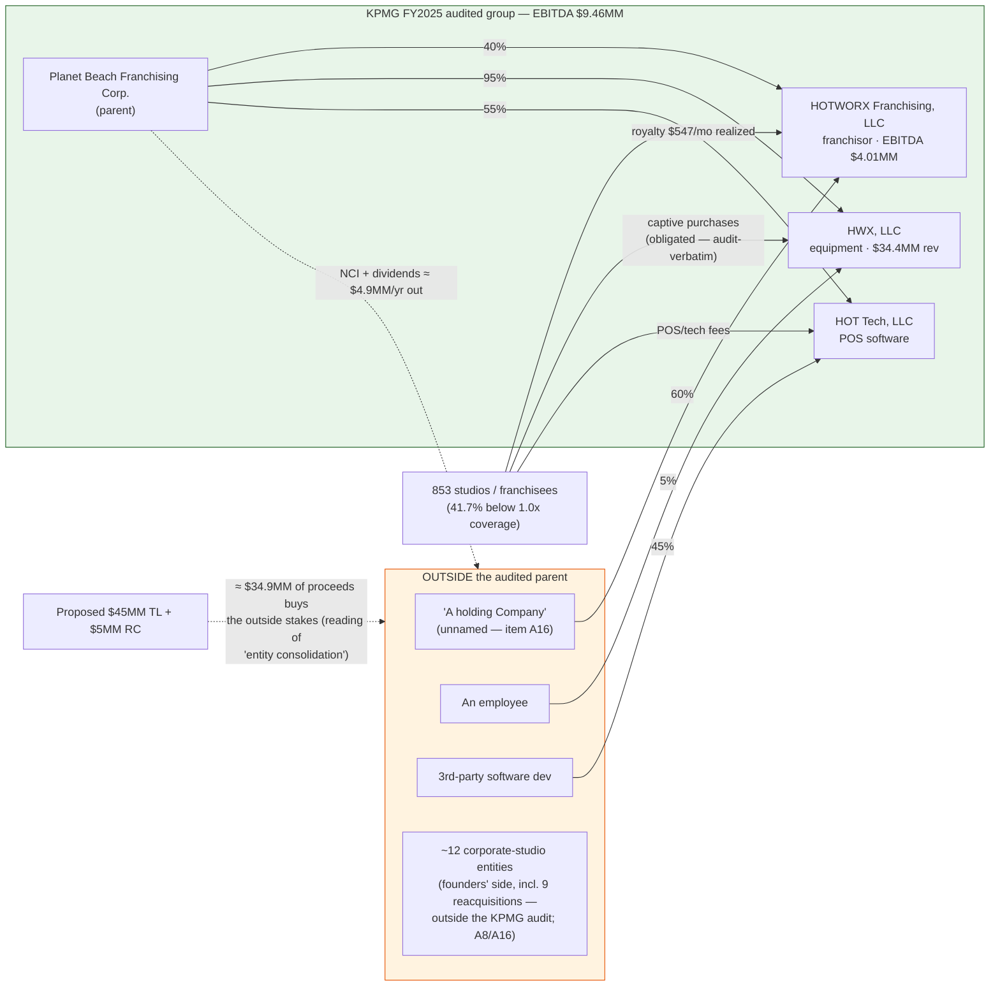
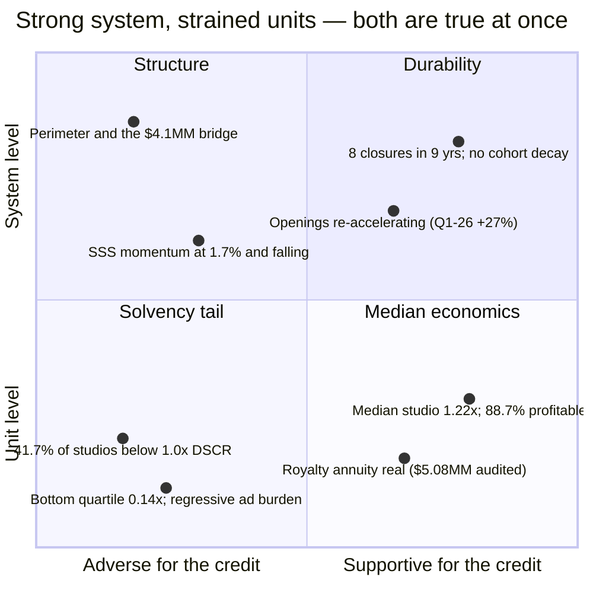
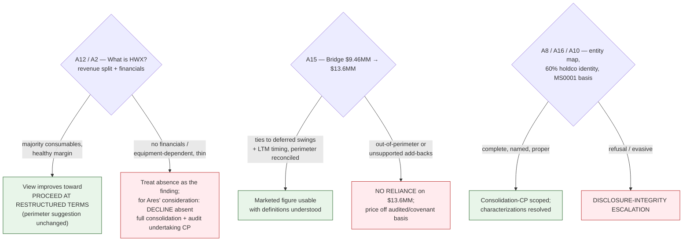
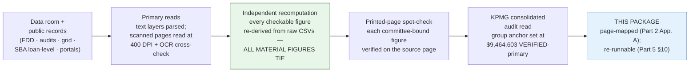

<!-- ============================================================
  CreditSwan.ai — Project Accelerate: Complete Advisory Package
  Single-file markdown · deployable as-is on any Vercel markdown stack
  Mermaid blocks render on GitHub, Nextra, VitePress, Docusaurus(+plugin);
  Unicode charts render in every markdown viewer as a guaranteed fallback.
============================================================= -->

<div align="center">

# 🦢 CreditSwan.ai

### **PROJECT ACCELERATE — COMPLETE ADVISORY PACKAGE**
**Independent Credit Diligence · HOTWORX Inc. · Prepared for the Ares Credit Team**

**27 July 2026 · Document ID PA-CSW-2026-0727-FULL · Ten parts, one file**

</div>

> **CONFIDENTIAL — PREPARED FOR THE ARES DEAL TEAM ONLY.** This file contains non-public diligence material. If hosted (e.g., on Vercel), deploy behind access control; do not index publicly. Personal contact details of individual franchisees are deliberately **not** reproduced in this file — they remain in the source CSVs referenced in Part 8.

> **ADVISORY POSTURE (STANDING RULE).** CreditSwan.ai is an advisor to Ares, not a decision-maker. Every statement in this package — including its conclusions — is a suggestion or an option for the deal team's consideration. Decisions on transmissions, structural terms, outreach, and spend rest solely with Ares.

> **TIMETABLE ASSUMPTION.** An investment-committee date of **Wednesday 29 July 2026 is assumed throughout and has never been confirmed** in any document we hold. Confirming it is Decision 1 in the cover memo.

---

## Part 0 — Cover Memo

**To:** Ares Management — Private Credit, Project Accelerate deal team
**From:** CreditSwan.ai
**Date:** 27 July 2026
**Re:** HOTWORX Inc. — complete advisory package (final CreditSwan work product)

This is the complete, self-contained work product. We may not re-engage after transmission, so every task that assumed our later involvement — folding Baird's answers, the KPMG read, outreach execution — ships here as something the deal team can run alone.

**Bottom line, in one paragraph.** In our view the credit as marketed is not supportable: the 3.3x exists only on a $13.6MM "Cash Adjusted EBITDA" that exceeds the entire group's **audited** FY2025 EBITDA of $9.46MM by ~44% and is unreconciled to it; on the audited franchisor alone the same $45MM is ~11x; and the franchisor is 60%-owned by an unnamed holding company outside the audited parent, with KPMG's own language confirming that consolidation is not recourse. A restructured basis exists if Ares elects to pursue it — the audit makes it *more* definable, not less — and Part 2 §10 states the option set. Every figure asserted is VERIFIED (primary, internal, or external) and page-mapped in Part 2 Appendix A.

**The ten parts:** (1) Executive dashboard · (2) Final Advisory Report v4 · (3) Transmission-ready IR package (IR #3 + Addendum A1–A16) · (4) Rationale note for the new Addendum items · (5) Downside scenario annex, rebuilt on the audited basis · (6) Term-sheet grid markup + CP schedule · (7) Baird response evaluation key · (8) Franchisee outreach kit · (9) Execution playbook + open-items log · (10) Refreshed project record & handoff.

**Three decisions only the deal team can make:**
1. **Confirm the IC date** (assumed Wed 29 July — never stated anywhere in the file; the timetable and the both-branches structure of Parts 2 and 5 key off it).
2. **Send or hold the Part 3 IR package**, and supply the signature block ([Name]/[email]/[phone]/[date of prior IR] placeholders are flagged inline).
3. **Elect or decline on franchisee outreach (Part 8) and the card-panel merchant-tagging call** — our suggestion on the latter remains to defer to post-close monitoring; the choice is Ares' alone.

— CreditSwan.ai

---

## Contents

| Part | Title | Purpose |
|---|---|---|
| 1 | Executive Dashboard | The whole case in charts — for a five-minute senior read |
| 2 | Final Advisory Report v4 | The synthesis: conclusion, evidence, decision tree, errata, source map |
| 3 | Transmission-Ready IR Package | One consolidated letter to Baird: IR #3 (1–12) + Addendum A1–A16 |
| 4 | Rationale Note | One sentence per new Addendum item, for a minutes-long sign-off |
| 5 | Downside Scenario Annex (v2, Audited Basis) | Rebuilt scenarios, every switch exposed, re-runnable without us |
| 6 | Term-Sheet Grid Markup + CP Schedule | Draft language for the blank lender column, for Ares & counsel |
| 7 | Baird Response Evaluation Key | Satisfactory vs red-flag answers, item by item |
| 8 | Franchisee Outreach Kit | Stratified sample spec + interview guide (decision is Ares') |
| 9 | Execution Playbook & Open-Items Log | Everything that survives without CreditSwan, with owners |
| 10 | Refreshed Project Record & Handoff | Status log, errata, do-not-reopen list, file map |

*Rendering note: `mermaid` blocks (diagrams) render on GitHub and standard Vercel documentation stacks; every quantitative chart is also drawn in Unicode inside fenced blocks so nothing is lost in a plain renderer.*

**Three reading paths.**
**5 minutes** → Part 1 (the dashboard) plus the three decisions in the cover memo above.
**20 minutes** → add Part 2 §§2–6: the conclusion, the governing finding on the audited basis, the four-quadrant evidence story, and the scenario summary.
**90 minutes** → the full file in order; every load-bearing figure is mapped to its source page at Part 2, Appendix A, and every scenario re-derives from the formulas at Part 5 §10.

---
# Part 1 — Executive Dashboard

*Every number below is VERIFIED (primary/internal/external) or explicitly labeled; sources are page-mapped in Part 2, Appendix A.*

## 1.1 The one chart that decides the meeting — leverage by evidence basis

$45MM term loan against five defensible EBITDA definitions:

```
Marketed $13.6MM (unreconciled) │███████            3.3x   ← exists only pending the A15 bridge
Audited consolidated $9.46MM    │██████████         4.8x   ← KPMG FY2025, VERIFIED-primary
Suggested covenant $6.08MM      │███████████████    7.4x   ← ex-termination fees & rebates
Franchisor alone $4.01MM        │██████████████████████    11.2x
Franchisor, covenant $2.11MM    │███████████████████████████████████████████  21.4x
                                └──────────────────────────────────────────── (½x per block)
```

**The invariant:** no scenario in Part 5 changes this ladder — only the obligor perimeter does.

## 1.2 Who actually owns the cash flows



KPMG's own words: VIE assets "do not represent additional assets that could be used to satisfy claims against the Company's general assets" — **consolidation ≠ recourse**; guarantees and pledges (Part 6) are the counterpart to any group-level number.

## 1.3 The four-quadrant evidence story



## 1.4 The solvency tail — the trigger that fired at 2× its threshold

Share of studios below 1.0x franchisee debt-service coverage, by opening vintage (current-market SBA terms, $75,482/yr):

```
2018 │████████████             23.3%
2019 │████████████████         32.1%
2020 │███████████████████      38.5%
2021 │████████████████████     40.0%
2022 │█████████████████████    41.0%
2023 │█████████████████████    41.4%
2024 │██████████████████████████  51.1%  ← the problem cohort: 143 studios, 11.25% median rate
2025 │█████████████████████████   50.0%
     └────────────┼──────────── (2% per block)   escalation threshold ≈ 20% ▲ tripped at 41.7% overall
```

Coverage by quartile (median DSCR): `0.14x │ 0.87x │ 1.60x │ 3.04x` — **the bottom half of the system does not cover its debt**, yet closures run ~0.5%/yr: distress exits through **transfers (13× closures) and reacquisitions**, not the closure line. ≈36% of the royalty annuity is paid by sub-1.0x studios.

## 1.5 Growth engine vs. demand momentum

```
Gross openings                       Same-store sales (42-month basis)
2022 │███████████████████████ 173    Jun-25 │█████████████████████████████ 14.4%
2023 │███████████████████████ 173    Sep-25 │█████████████████████ 10.4%
2024 │███████████████████ 143        Dec-25 │████████████████ 7.9%
2025 │█████████████ 95               Jan-26 │███████ 3.7%
LTM  │█████████████▌101 (Q1-26: 33)  Feb-26 │█████ 2.7%
     └(5 per block)                  Mar-26 │███ 1.7%  ← marketed LTM ends exactly here
```

Backlog corroboration is audited — deferred equipment revenue **$3.84MM → $9.56MM (+149%)** — but the marketed **598** backlog is not: Exhibit C reconciles exactly to **220** signed-unopened (797 + 15 + 220 = 1,032).

## 1.6 From marketed to lender-attributable — two waterfalls

```
(a) The unreconciled bridge (suggested item A15)          (b) Definitions, then perimeter
$13.6MM  marketed "Cash Adjusted" LTM Mar-26              $9.46MM  audited group
   │  −$4.1MM  ← no line-item bridge exists                  │  −$1.09MM termination-triggered fees
   ▼            (deferred-revenue swings of ~$7.0MM          │  −$2.29MM vendor rebates
$9.46MM  KPMG audited FY2025 group EBITDA                    ▼
                                                          $6.08MM  suggested covenant basis (7.4x)
                                                             │  − everything not pledged as marketed
                                                             ▼
                                                          $4.01MM franchisor → $2.11MM covenant-style
```

## 1.7 Scenarios on the covenant basis (Part 5) — and the finding hidden in "reported"

```
Covenant-basis leverage, Branch A          R1 Base      │█████████████ 6.5x
(1 block = ½x; Branch B in Part 5)         R2 Downside  │████████████████ 8.1x
                                           R3 Severe    │█████████████████ 8.6x
                                           R4 Zero-grow │██████████████████ 9.2x   (Branch B: 20.9x)
```

On **reported** GAAP the downside is nearly invisible (R2/R3 ≈ $9.4–9.6MM, flat to FY25) because each terminated agreement accelerates ≈$10,370 of deferred fees into income — FY2024's $1.76MM is audited precedent. **Attrition manufactures reported EBITDA**; the covenant series is the decision series, and the grid's TNLR covenant inherits the flattering unless the definition excludes termination fees (Part 6).

## 1.8 What resolves the branches — three asks, one map



On the assumed 29 July IC date, none of the three is likely answered pre-committee — which is why Parts 2 and 5 carry **both branches in full** rather than adjudicating.

## 1.9 Why these numbers can be trusted — the verification chain



Tie-out record: the four Item 19 named studios reproduce from the raw data pack to within **±$1** on both revenue and EBITDA; the 717-studio disclosed population reproduces to 0.2–0.5%; pack royalty ties the KPMG-audited royalty line within **0.4%**; year-end unit counts tie the sworn FDD **exactly** at 2022, 2023 and 2025; franchisee debt service is built from public SBA 7(a) loan-level data, not company inputs. Where we found our own error, we said so: one same-day restatement (zero-growth fee recognition) is disclosed at Part 2 §11(8) and in the Part 5 revision note — the correction ran **against** our own severity, which is what evidence discipline is for. Everything asserted carries an evidence label (legend in the Colophon); everything merely inferred or assumed is barred from assertion and marked as a switch the reader can reset.

---

# Part 2 — Final Advisory Report (v4)

**Prepared by CreditSwan.ai for the Ares Credit team · 26 July 2026 · Replaces the Pre-Committee Diligence Brief v3**

**Advisory posture (standing rule).** CreditSwan.ai is an advisor to Ares, not a decision-maker. Everything in this report — including the conclusion — is a suggestion or an option for the deal team's consideration. Decisions on transmissions, structural terms, outreach, and spend rest solely with Ares. Where v3 used directive language ("must resolve," "non-negotiable"), this report recasts it; where the underlying analysis has not changed, the recast is of voice, not of substance.

**Self-containment.** This is the last CreditSwan work product before the package goes to the deal team on Monday 27 July, and we may not re-engage. The synthesis that would normally happen after Baird responds is therefore **embedded here as a decision tree** (§9): for each open item, what a satisfactory answer looks like, what a red-flag answer looks like, and the suggested committee treatment of each branch. Nothing in this report requires our presence to act on.

**Timetable assumption.** An investment-committee date of **Wednesday 29 July 2026 is assumed throughout and has never been confirmed in any document we hold.** It matters in two places: the pending items that would collapse this report's conditional branches (A12; suggested A15/A16) are unlikely to arrive before a 29 July committee, and the suggested IR acknowledgment deadline keys off it. Confirming the date is the first of the three deal-team decisions listed in §14.

---

### 1. What changed since v3

v3 was written before the studio-level data pack was opened, before the KPMG consolidated audit was read, and before the final external sweep. Sessions 5–6 completed all three, plus an independent verification pass of every checkable number. Seven v3 positions are superseded and should not be carried forward:

1. **"63.5% of revenue is unaudited" is superseded as a framing.** HWX, LLC is consolidated as a VIE inside the KPMG FY2025 audit, which we have now read. An audited consolidated view exists — and it shows **group EBITDA of $9,464,603 against a marketed $13.6MM** (VERIFIED-primary). The problem has not shrunk; it has changed shape: from "the majority of the base has no audit" to "the audited base is $4.1MM smaller than the marketed base, the franchisor is 60%-owned outside the audited parent, and KPMG's own language says consolidation is not recourse."
2. **The "$9.1MM consolidated operating income is SECONDHAND" caveat is withdrawn.** Confirmed at $9,077,035, VERIFIED-primary.
3. **The "~$9.6MM non-HFRAN EBITDA" inference is superseded.** Post-elimination non-HFRAN EBITDA computes to ≈ **$5.45MM** from the audit.
4. **The v3 downside table is withdrawn** and replaced by the rebuilt annex (`Project_Accelerate__Downside_Scenario_Annex__v2_Audited_Basis.md` — **Part 5 of this package** — summarized in §6). The 79-openings realization haircut is invalidated by Q1-2026 actuals (33 openings, +27% YoY; LTM 101); stress is relocated to the coverage tail's actual channels.
5. **Every forward franchisor build now uses realized royalty of $547/studio-month**, not the $695 headline (VERIFIED-internal; corroborated within 0.4% by the audited royalty line and now mechanism-sourced to Item 19 Note 6's legacy schedules of $550/$595/$695).
6. **The SSS-restatement credibility allegation is de-escalated.** The restated series reproduces independently on the 42-month basis. The finding that remains is worse for the credit and cleaner for the company: same-store momentum has collapsed 14.4% → 1.7% (Jun-25 → Mar-26) on every tested basis.
7. **Errata carried transparently** (§11): 214 → 191 DMA-only Exhibit C entries; 9.14% is the mean FY2026 SBA rate and 9.375% the median (the $75,482 debt-service anchor correctly uses the median); a $1 and a $35,232 internal FDD-vs-audit variance; the Exhibit D transfer-tally basis footnote.

---

### 2. Advisory conclusion — stated up front, conditional by design

**In our view, the credit as marketed is not supportable.** The marketed 3.3x exists only on a $13.6MM "Cash Adjusted EBITDA" that exceeds the entire group's audited FY2025 EBITDA by ≈ 44% and is unreconciled to it; on the audited consolidated group the same $45MM is 4.8x; on the suggested covenant definition, 7.4x; on the audited franchisor alone, ≈ 11x; and the franchisor itself is only 40%-owned by the audited parent. No scenario arithmetic changes this — the rebuilt annex demonstrates it row by row — because the issue is the obligor perimeter and the EBITDA definition, not the forecast.

**A restructured basis exists if Ares elects to pursue it, and the KPMG read has made it more definable, not less:** the audit supplies a precise entity and ownership map, audit-verbatim confirmation of the captive-revenue architecture, and a clean set of covenant-definition exclusions. The option set is in §10; the draft grid language ships as a separate artifact. Whether to pursue, on what terms, and whether to transmit anything to Baird are expressly the deal team's decisions.

**The leverage ladder (all on the $45MM TL; a fully drawn revolver adds ≈ 0.5x on the audited base):**

| Basis | EBITDA | Leverage | Status |
|---|---:|---:|---|
| Marketed LTM Mar-26 "Cash Adjusted" | $13,600,000 | **3.3x** | SECONDHAND — unreconciled; suggested item A15 |
| Audited consolidated FY2025 (KPMG) | $9,464,603 | **4.8x** | VERIFIED-primary |
| Group, suggested covenant definition | $6,081,349 | **7.4x** | Computed from VERIFIED-primary components |
| Audited franchisor (HFRAN) standalone | $4,011,722 | **11.2x** | VERIFIED-primary |
| HFRAN, covenant-style | $2,105,878 | **21.4x** | Computed from VERIFIED-primary components |

---

### 3. The governing finding, restated on the audited basis

FDD Item 8 disclosed the composition; the KPMG consolidated audit now supplies the ownership, the recourse language, and the group number. Together they define the credit:

**Composition (VERIFIED-primary).** HOTWORX Franchising, LLC — the franchisor — generated $13,578,055, 25.0% of consolidated FY2025 revenue. HWX, LLC — the equipment/sauna distributor, importer of record for the China-sourced saunas named in the settled wrongful-death action disclosed in the FDD — generated $34,427,082 (63.5%), 99% franchisee-derived. HOT TECH $3,316,036 (74% franchisee-derived). The recurring base is ≈ $12.4MM (22.9%); the transactional share ≈ 77%. On v2's own re-underwriting thresholds (recurring < 25% of revenue or recurring EBITDA < $5MM → treat as an equipment-distributor credit), both still trip.

**Ownership (VERIFIED-primary, new).** Per the audit's Note 1, all consolidated as VIEs under ASC 810:

| Entity | Audited parent % | Outside % | Outside holder |
|---|---:|---:|---|
| HOTWORX Franchising, LLC (franchisor) | **40%** | **60%** | "a holding Company" — **unnamed** (suggested item A16) |
| HWX, LLC (equipment) | 95% | 5% | an employee |
| HOT Tech, LLC (POS software) | 55% | 45% | third-party software developer |
| ISO HOT, LLC (one studio) | 30% | 70% | undisclosed |

*Reconciliation note:* FDD Item 8 describes HWX, LLC as part-owned by officers Smith, Price and Grandbouche; the audit shows 95% parent / 5% "an employee." The two are consistent if the officers' interest runs through the parent and/or the unnamed employee stake — but the reconciliation should be stated, not assumed, and belongs in the A16 entity map.

The franchisor annuity — the asset the 3.3x multiple is notionally priced on — is **majority-owned outside the audited parent.** FY2025 non-controlling interests took **46.0% of group income** ($4,020,822 of $8,731,574) and received $3,939,953 in cash distributions; with $950,000 of stockholder dividends, total owner cash extraction was ≈ **$4.9MM**. The NCI balance is $10,664,718.

**Recourse (VERIFIED-primary, audit-verbatim).** KPMG's consolidation note states the VIE assets "do not represent additional assets that could be used to satisfy claims against the Company's general assets." Consolidation is not recourse. Any group-level underwriting therefore depends on guarantees and share pledges, not on the consolidated presentation.

**Architecture (VERIFIED-primary, audit-verbatim).** Franchise purchasers "are obligated to purchase HOTWORX equipment, products and software from HWX and HOT Tech" — the captive-revenue structure is now audited language, not inference. The three operating companies have **no employees**; all activity is run by parent staff under quarterly payroll reimbursement, so transfer pricing between the entities sits entirely inside management's discretion. The VIEs hold **$33,411,337** of pre-elimination due-from-affiliate claims.

**Perimeter (VERIFIED-primary, new).** The audit consolidates the parent plus five VIEs and contains only three studio entities. Item 19 Table 19.3 discloses **fifteen** corporate studios — so roughly a dozen, presumably including the nine 2025 reacquisitions, sit in entities **outside the audited group**, on the founders' side (suggested items A8/A16). HOTWORX Canada and HOT Brands, LLC are related but unconsolidated. The Forvis QoE marketed the $13.6MM on an undisclosed perimeter and sits under a **non-reliance access letter** — a legal point we flag for counsel and do not opine on.

**The bridge (VERIFIED-primary that it is missing).** Marketed $13.6MM less audited $9.46MM = ≈ $4.1MM (+44%), nowhere reconciled in the audited statements. Candidate cash-basis logic exists — deferred franchise fees grew +$1.29MM and deferred equipment revenue +$5.73MM, a cash-over-GAAP swing of ≈ $7.0MM that could over-explain the gap, plus LTM-vs-FY timing — but only Baird/the QoE can reconcile it. This is suggested item **A15**, and until it is answered we would suggest the audited figure is the only leverage denominator with an evidence pedigree.

**The deal-mechanics reading.** "Corporate entity consolidation" in the use of proceeds is best read as the purchase of these outside stakes — i.e., much of the $34.9MM founder/management liquidity **buys the 60% franchisor holdco** (and possibly other NCI). The grid's Closing Condition that consolidation completes at close is what converts group EBITDA into lender-attributable EBITDA; the loan funds the purchase of the cash flows it is secured on.

---

### 4. The evidence story in four quadrants

**Survival is strong; solvency is weak — and both are true at once.** Eight studios have gone permanently dark in nine years; mature-cohort NetEFT does not decay after month 36 even survivorship-corrected (index 100 → 106 → 103 → 110 at m36/48/60); the seasoned SBA charge-off rate is 0.53% (1 of 189 FY20–22 loans; 2 charge-offs / $69,998 across all 488 loans totalling $180.7MM). The counterweight inside the same dataset: 43% of all HOTWORX franchisee SBA loans sit with just two banks (Huntington 123, Citizens 87), so the financing pipeline that converts backlog into openings has concentrated appetite risk. And yet **41.7% of the 751 full-TTM studios cannot cover current-market franchisee debt service at 1.0x** (32.2% even vintage-matched), against a ~20% escalation threshold — tripped at more than 2x. The reconciliation is structural: franchisees are locked into ten-year SBA notes and five-year leases, so distress converts into **transfers and reacquisitions, not closures** — transfers (27/37/40 in 2023–25) run ≈ 13x closures. Today's coverage shortfall is tomorrow's transfer, stalled second unit, and slower backlog conversion.

**The median studio is fine; the tail is structural.** Median coverage 1.22x; 88.7% of mature outlets EBITDA-positive. But the bottom quartile sits at **0.14x** — $10,402 of median EBITDA against a $75,482 obligation on ≈ $396K of invested capital — and the cost base is regressive **from actual spend, not from the fee schedule**: local advertising runs 13.5% of revenue at the bottom decile versus 4.7% at the top on near-identical dollars, and the fixed fee stack is 4.0% of bottom-third revenue versus 1.9% of top-third. Weak studios do not self-correct; the 2024 vintage (143 studios, borrowed at 11.25% median) is the problem cohort at 0.92x median coverage, 51.1% sub-1.0x, and deterioration by vintage is monotone (2019–20: 35.6% → 2021–22: 40.7% → 2023–24: 45.8%).

**The franchisor annuity is real, small, and partly sourced from the tail.** Audited royalty is $5,078,630; realized royalty $547/studio-month against the $695 headline (−21%, mechanism now primary-sourced); HFRAN standalone EBITDA $4,011,722 exact. Roughly **36% of the royalty annuity is paid by the 313 sub-1.0x studios** and 9% by the 78 EBITDA-negative studios. Termination-triggered fee recognition was 41% of FY2025 franchise-fee revenue (52% in FY2024) — reported franchisor revenue is counter-cyclically flattered by the very attrition that signals stress. Deferred franchise fees of $16.35MM amortize on a locked ten-year straight line running from agreement execution ($1.77MM scheduled for 2026), so franchise-fee revenue is mostly past selling, not current selling — and the reported franchise-fee line is already declining ($3,358,269 FY24 → $2,653,804 FY25) while termination-triggered recognition ran $1,135,931 / $1,758,162 / $1,088,891 across FY23–25. For balance, three genuine positives in the same audited statements: HFRAN recurring fees have grown $6.04MM → $8.24MM → $9.95MM over three years; operating income ex-the-FY24 charge is stable (~$3.4–3.8MM each year); and realized royalty should drift upward from $547 as legacy $550/$595 agreements renew toward $695 — a modest tailwind we have not modelled. Two caveats on the annuity's edges: studio EBITDA throughout is before owner compensation (the FDD does not disclose the owner-operator mix), and roughly half the technology fee stack is billed outside HFRAN ($2,676,810 system-billed vs $1,479,350 in HFRAN's audited line — the A4 quantification).

**Openings are re-accelerating into decelerating demand.** Q1-2026 openings 33 (+27% YoY), LTM 101 against the FDD's 108 projection, corroborated by the audited deferred-equipment balance (+149% to $9.56MM). Simultaneously, same-store growth has collapsed to **1.7%** (Mar-26, independently computed), members per studio are flat year-on-year, and median first-year memberships are falling across vintages (479 → 412, 2020 → 2025). The $13.6MM LTM figure is being marketed at the exact point where same-store momentum reaches zero — and the 2025 step-up in median studio EBITDA ($69,383 → $88,535) was a membership-density event that has not repeated.

---

### 5. Two disclosure observations the committee should hear characterized, not assumed

**MS0001.** The #1 studio of 853 by TTM EBITDA ($712,425 on $1,157,529) is excluded from the Item 19 earnings claim, whose disclosed ceilings are $554,589 (franchised, Table 19.2) and $708,002 (corporate, Table 19.3) — both now OCR-verified against the printed FDD. Exhibit C names its franchisee as "Stephen P. Smith John Antwine"; four studios associate with Stephen P. Smith or his planetbeach.com email, including one at the franchisor's own headquarters address. The exclusion may be entirely proper if the studio is outside the disclosed population; the basis should be stated in writing (item A10). As written: **the top of the disclosed earnings range is set by excluding the founder's own outlet.**

**The four undisclosed exits.** KS0004, IL0001, AZ0001 and MI0026 are dark in the pack and absent from both Exhibit C and Exhibit D. Three went dark in 2024 (outside Exhibit D's 2025 scope — a fair explanation); KS0004 has been dark since March 2020 and appears nowhere. Correct characterization: *not disclosed in the exhibits we hold*, rather than *concealed*; a small, cheap IR item (A13). Also for the record: five operating studios in the pack are absent from the sworn franchisee list — NC0029, TX0056, FL0086, LA0010, TX0207 — the best available candidates for company-owned outlets (item A8), and the member counts in the pack sum to 424,884 against the deck's "400,000+" claim — the claim is not contradicted, but no Item 19 member row exists to verify it (X1 stays open).

---

### 6. Scenarios — summary of the rebuilt annex

Full mechanics, switchboard, and re-run formulas are in **Part 5 of this package**. The headline table (Branch A = consumables-annuity reading of HWX; Branch B = opening-dependent equipment; pending A12):

| Scenario | Openings | YE units | Covenant EBITDA (A / B) | Covenant leverage (A / B) |
|---|---:|---:|---|---|
| R1 Audited-anchored base | 105 | 913 | $6.87MM / $6.82MM | **6.5x / 6.6x** |
| R2 Coverage-tail downside | 100 | 904 | $5.55MM / $5.47MM | **8.1x / 8.2x** |
| R3 Severe | 88 | 887 | $5.21MM / $5.17MM | **8.6x / 8.7x** |
| R4 Zero-growth 2027 | 0 | 845 | $4.90MM / $2.16MM | **9.2x / 20.9x** |

Three results we would suggest carrying to committee verbatim. **(i)** On reported GAAP EBITDA the downside is nearly invisible (R2/R3 ≈ $9.4–9.6MM, flat to FY2025), because each terminated agreement accelerates ≈ $10,370 of deferred fees into income — FY2024's actual $1.76MM is audited precedent. Reported EBITDA is counter-cyclically flattered exactly when the system deteriorates; the covenant series is the decision series, and a TNLR covenant set on "Cash Adjusted EBITDA" as drafted in the grid would inherit the flattering unless the definition excludes termination-triggered fees. **(ii)** The Branch A/B spread prices A12: within ~$0.2MM of each other in any growth year, $4.1MM of reported EBITDA and ≈ 12 turns of covenant leverage apart under zero growth (9.2x vs 20.9x). **(iii)** No modelled row reaches the marketed basis; the best audited-anchored case sits $3.1MM below $13.6MM, and the gap is the unreconciled A15 bridge, not a stress assumption. On the coverage side (grid pricing is S + [TBD], so run as an 8–11% illustrative band): the severe case crosses below 1.0x interest-plus-amortization coverage at ≈ 11% all-in, zero-growth at ≈ 10% — and **the audited franchisor alone does not cover at any rate in the band.**

---

### 7. Kill questions and inconsistency register — final statuses

**K1 (revenue architecture): CLOSED.** Composition and ownership fully mapped (§3). Residual live sub-question is HWX's margin and mix — A2/A12.
**K2 (backlog quality): SUBSTANTIALLY ANSWERED.** The marketed **598** backlog is not supported: Exhibit C's 1,032 location codes reconcile exactly as 797 franchised + 15 corporate + **220 signed-unopened** (an exact tie to Item 20 Table 5); 57% of entries carry Area Developer status, so unexercised ADA options are the plausible — but unverified — innocent explanation for the 598-vs-220 gap. 191 of the signed-unopened entries are DMA-only; 67 agreements / 105 codes terminated in 2025 is backlog attrition at scale against 95 openings; offset by +44% like-for-like SBA approvals and the Q1-26 opening run-rate. Fair read for 2026: 100–110 openings (annex S1).
**K3 (cohort survival / unit economics): SPLIT, both halves answered.** Survival, revenue-trend and concentration triggers do not fire (top-25 franchisee concentration 16.7% of system NetEFT across 617 operator groups, largest holding ten units); the franchisee-solvency trigger fires at 2x threshold. §4.

| | v3 status | v4 status |
|---|---|---|
| **X1** membership 400K+ | Sharpened, unresolved | **Unresolved.** Pack sums 424,884 at Mar-26; no Item 19 member row exists to verify the deck claim. IR item 8 stands. |
| **X2** SSS restatement | Unresolved | **De-escalated.** Reproduces independently (42-month basis). Keep IR 9 for the written explanation and the prior pack; drop as a credibility allegation. The momentum collapse is the finding. |
| **X3** closure rate | Resolved | Resolved; independently corroborated by the pack (0.00/0.68/0.41%). |
| **X4** investment range | Resolved | Resolved. |
| **X5** entity perimeter | Single most important open item | **Recast and confirmed as governing** on the audited ownership map: 40/60 franchisor, unnamed holdco, NCI 46%, ring-fencing language, 15-vs-3 corporate-studio gap. §3. |
| **X6** FDD scope overlap | Partially resolved | Unchanged; MN registration cured 16 Apr 2026. |
| **X7** FY2024 loss | Resolved as artefact; characterization open | **Sharpened.** The charge sits in HFRAN's own audited P&L: FY2024 operating expenses $8,047,209 vs $4,028,468 in FY2025; FY2024 operating income −$1,307,410. A1 stands with better ammunition. |
| **X8 (new)** naming collision | — | "HWX Chicago, LLC" in Exhibit E is a consolidated VIE corporate studio (formed 2018, closed 2024) — **not** HWX, LLC the equipment distributor. Flagged so committee readers don't conflate. |

---

### 8. External position (final sweep, 26 July — VERIFIED-external)

Negative assurance obtained for ≈ Apr–26 Jul 2026 on new litigation, state franchise enforcement, mass closures, leadership changes, and any leak of the process. *Skistimas v. HOTWORX* was compelled to AAA arbitration and stayed 22 Oct 2024 (personal jurisdiction found over Smith, Price and recruiter Gattuso); no public award or settlement — arbitration is private, and a live PACER pull is a suggested deal-team confirmatory. **The wrongful-death premise is not publicly verifiable**: no matching case or CPSC recall was found, so the package cites that action strictly to the FDD's own Item 3 disclosure, and the deal team may wish to request the caption and settlement papers directly. Sector regulatory tail: **FTC v. Xponential Fitness (18 Mar 2026, $17MM franchisee redress — the largest-ever, on misleading opening-timeline/earnings claims, plus ≈ $22.75MM of related private settlements)** is the governing precedent directly analogous to the Skistimas allegations against HOTWORX's Item 19 representations; the restarted click-to-cancel rulemaking and *FTC v. Fitness International* bear on the 60-day cancellation policy and recurring billing. Tariffs: saunas classify HTS 8516.79.0000 at MFN 2.7%; the Section 301 layer is unresolved in public sources (0% vs 7.5%+) and is carried as an explicit margin switch in the annex — obtaining HWX's entry summaries closes it. Market benchmark: Xponential's $525MM TL (Dec 2025, HPS agent) is performing; 2026 private-credit tone is lender-favorable with sharper add-back scrutiny. A de-minimis CA Prop 65 matter against related, unconsolidated **HOT Brands, LLC** settled Nov 2025 (~$20K); entity linkage worth confirming. One WS6 datum from the audited statements worth pairing with IR item 7: HFRAN's litigation accrual was $72,150 at 12/31/2024 and **nil at 12/31/2025** — consistent with the ~$380,000 wrongful-death settlement having been funded elsewhere, most likely by insurance or by HWX, LLC directly; the loss runs should confirm which, because the answer locates the product-liability tail.

---

### 9. Embedded decision tree — the synthesis we will not be present to perform

For each pre-committee item: the satisfactory branch, the red-flag branch, and the suggested treatment of each. (**Part 7** of this package restates this as a working checklist.)

| Item | A satisfactory answer looks like | A red-flag answer looks like | Suggested treatment of each branch |
|---|---|---|---|
| **A2 / A12** — HWX standalone financials; FY25 revenue split (equipment to new/relocating outlets vs consumable resupply, with unit counts) | Reviewed or audited HWX statements; majority-consumables mix at a healthy margin | No statements exist; refusal; equipment-dominant mix at thin margin | Satisfactory → in our view the picture improves toward **proceed at restructured terms** (annex Branch A); the perimeter suggestion is unchanged. Red flag → we'd suggest treating the absence itself as the finding and, for Ares' consideration, **declining absent full obligor consolidation plus an audit undertaking as a CP**. |
| **A15 (suggested, new)** — line-item bridge from KPMG audited $9.46MM to marketed $13.6MM | Bridge ties to the identified cash-over-GAAP deferred swings and LTM timing, reconciled to the QoE perimeter | Bridge relies on out-of-perimeter studios or unsupported pro-forma add-backs, or cannot be produced | Satisfactory → marketed figure usable **with definitions understood** (covenant basis still suggested for documentation). Red flag → we'd suggest **no reliance on the $13.6MM**; leverage and pricing set on audited/covenant bases. |
| **A1** — character of the FY2024 $5,012,174 related-party charge and its QoE treatment | Documented non-recurring, correctly treated in the QoE bridge; consistent with HFRAN's audited FY2024 opex swing | Recurring character, vague support, or QoE adds it back without basis | Satisfactory → FY2024 is an artefact; note only. Red flag → covenant-definition **and integrity** implications; the charge sits in HFRAN's own audited P&L, so the characterization is testable. |
| **A3** — intercompany balances; whether any part is repaid from proceeds | Balances documented; none repaid from proceeds; standstill acceptable | Proceeds repay affiliate balances; the $33.4MM pre-elimination claim web unexplained | Satisfactory → standstill documents the status quo. Red flag → we'd suggest **sharpened use-of-proceeds conditionality** plus the hard RP block. |
| **A8 / A16 (A16 suggested, new)** — corporate-studio entity list reconciled to Table 19.3's fifteen; location of the reacquisition entity; identity and ownership of the 60% HFRAN holdco | Complete reconciliation; entities and holders named | Refusal or partial disclosure | Satisfactory → consolidation-CP scope is set by the answer. Red flag → **disclosure-integrity escalation**; the audited group cannot be underwritten while its majority owner is unnamed. |
| **A10** — basis for excluding MS0001 (and the $554,589 studio's inclusion) from Table 19.2; ownership of MS0001, LA0006, LA0038, LA0046 | A proper population basis, in writing (e.g., company-owned/out-of-population) | Evasive or inconsistent with Exhibit C | Satisfactory → characterization resolved; note for the record. Red flag → **disclosure-integrity escalation** (Item 19 ceiling set by excluding the founder's outlet). |
| **A11** — schedule reconciling $547 realized royalty to the $695 rate, by cohort | Legacy schedules ($550/$595/$695), discounts and holidays quantified | Large waiver/non-payer population | Satisfactory → modelling input settled. Red flag → annuity-quality downgrade in the franchisor build. |
| **A13** — Item 20 disposition of KS0004, IL0001, AZ0001, MI0026 | Prior-year exit-column entries produced | Cannot be located | Satisfactory → closes cleanly. Red flag → escalate with A10 as a disclosure pattern. |
| **IR 1–5, A4–A7, A9, A14** | Per the transmission-ready IR package and the §3.5 response key | — | Evaluate per the key; none is individually gating except as they feed the branches above. |
| **QoE reliance** | — | — | The Forvis QoE sits under a non-reliance access letter prohibiting use to solicit financing. **Flag to counsel; we do not opine on the legal point.** |

**Suggested committee logic in one sentence:** the A2/A12 and A15 branches jointly determine whether a restructured proposal is worth pricing; A8/A16 and A10 determine whether disclosure integrity supports proceeding at all; everything else calibrates terms.

---

### 10. The restructured basis — an option set for Ares' consideration

If the deal team elects to pursue, the audit makes the restructured architecture precise. We would suggest conditioning any commitment on: **(i)** an obligor group including HWX, LLC and HOT Tech, LLC with full guarantees and share pledges — the necessary counterpart to KPMG's ring-fencing language; **(ii)** completion of the entity consolidation at close (already a grid Closing Condition), now scoped by the A8/A16 entity map so the fifteen corporate studios and the 60% holdco are demonstrably inside or expressly outside; **(iii)** covenant EBITDA excluding termination-triggered franchise fees ($1,088,891 FY25 / $1,758,162 FY24), vendor rebates, unrealized portfolio gains ($715,818 FY25 — sitting below operating income on a $12.5MM securities book held in the VIEs), and any related-party charge of the FY2024 character; **(iv)** a hard restricted-payments block and intercompany standstill against the $33.4MM claim web; **(v)** unit-opening and recurring-revenue maintenance triggers alongside TNLR, given that growth and the equipment engine both depend on openings; **(vi)** reporting covenants — monthly unit roll reconciled to backlog, backlog aging, studio-level NetEFT, quarterly HWX financials; **(vii)** product-liability minimums, additional-insured status, and a manufacturer-indemnity representation (WS6); and **(viii)** leverage and pricing re-cut off the restructured EBITDA definition rather than the marketed $13.6MM — on the annex arithmetic, that conversation starts near the covenant-basis 6.5–7.4x reality, not at 3.3x, and the 18.4x franchisor comparable set underpinning the marketed multiple does not apply to an equipment-distribution business with a franchising annuity attached. Draft grid language for the blank lender column is **Part 6** of this package; all of it is a starting draft for Ares and counsel.

---

### 11. Evidence discipline and errata

**Asserted in this report only if VERIFIED** (primary, internal, or external, as labeled). Items that remain barred from committee assertion without upgrade: the **~59% HWX consumables mix** (INFERRED from $20.41MM of franchisee wholesale-goods purchases; pending A12); the **HWX EBITDA margin** (a 12–25% assumption band, bounded above by the audited 46.7% product gross margin); the **marketed $13.6MM** (SECONDHAND, unreconciled; pending A15); the tariff import-share κ (assumption band 0.6–0.8); and the wrongful-death action beyond the FDD's own disclosure.

**Errata, carried transparently:** (1) 214 → **191** DMA-only Exhibit C entries (+4 OCR-garbled) = 195 codes absent from the pack; "roughly one in five cannot be geocoded" still holds. (2) FY2026 SBA rate: 9.14% mean / 9.375% median; the $75,482 anchor uses the median. (3) Below-1.25x/1.50x counts differ by 1–3 studios between memo and export — immaterial boundary effects. (4) HFRAN revenue $13,578,05**5** audited vs $13,578,05**4** in Item 8 text — cite the audited figure. (5) Consolidated revenue $54,208,749 audited vs Item 8's $54,243,981 (Δ $35,232). (6) Exhibit D S2 transfer tally: TX 14 by state header / TX 15 by code prefix (TX0242 filed under UTAH) — use the header basis with footnote. (7) The Semrush Site Health score is never to be cited (100-page-capped crawl, 91% redirects); the Semrush footprint file is external color only. (8) The scenario annex was restated same-day: its zero-growth switch originally assumed fee recognition stops with openings, whereas Exhibit E's policy amortizes initial fees straight-line **from execution** — R4 covenant leverage restates 10.4x → 9.2x (Branch A) / 28.6x → 20.9x (Branch B); direction unchanged, correction disclosed in the annex revision note.

---

### 12. Evidence register — Session 5–6 additions

E1–E60 stand as logged in v3 and the primary-read memo. WS2 writebacks (all VERIFIED-internal) are logged in `WS2_Results` §10. New this cycle:

| | Finding | Status |
|---|---|---|
| E61 | KPMG unqualified opinion, PBFC & Subs consolidated FY2025; operating income $9,077,035; **EBITDA $9,464,603**; subsequent events evaluated through 30 Apr 2026 — none disclosed (no mention of the contemplated financing). | VERIFIED-primary |
| E62 | Ownership map: HFRAN 40/60 (unnamed holdco); HWX 95/5; HOT Tech 55/45; ISO HOT 30/70. NCI balance $10,664,718; NCI income $4,020,822 (46.0%); distributions $3,939,953 + dividends $950,000. | VERIFIED-primary |
| E63 | Ring-fencing: VIE assets unavailable to general creditors (audit-verbatim). Captive-purchase obligation (audit-verbatim). Operating companies have no employees; quarterly payroll reimbursement. VIE due-from-affiliates $33,411,337 pre-elimination. | VERIFIED-primary |
| E64 | Marketed $13.6MM exceeds audited group EBITDA by ≈ $4.1MM (+44%); candidate cash-over-GAAP swing ≈ $7.0MM (deferred franchise fees +$1.29MM; deferred equipment revenue $3.84MM → $9.56MM). Bridge nowhere in the audited statements. | VERIFIED-primary (that it is missing) |
| E65 | Deferred franchise-fee runway $16,346,551 (2026 $1.77MM · 2027 $1.66MM · 2028 $1.62MM · 2029 $1.53MM · 2030 $1.41MM · thereafter $8.36MM). Termination-triggered fees = 41% of FY25 / 52% of FY24 franchise-fee revenue. | VERIFIED-primary |
| E66 | KPMG perimeter = parent + five VIEs; three studio entities inside vs **fifteen** corporate studios in Table 19.3; nine 2025 reacquisitions outside the audit; HOTWORX Canada and HOT Brands unconsolidated. | VERIFIED-primary |
| E67 | The $3.1MM refinancing target is a Morgan Stanley **demand** margin loan ($2,821,530 drawn, securities-collateralized, callable). Small building notes guaranteed by officers/stockholders through 2027. IRS 2020–21 exam closed favorably. HWX Chicago landlord litigation live ($86,657 remaining lease). Investment securities $12.5MM in the VIEs. | VERIFIED-primary |
| E68 | OCR spot-check: Item 19 ceilings $554,589 / $708,002 confirmed on the printed pages; MS0001 $712,425 exceeds both. Royalty legacy schedules $550/$595/$695 (Note 6); Table 19.2 royalty row ≈ $553/studio-month. HFRAN exact build $4,011,722. HFRAN FY2024 operating income −$1,307,410. | VERIFIED-primary |
| E69 | External sweep: negative assurance Apr–26 Jul 2026; *Skistimas* stayed to AAA arbitration 22 Oct 2024 (PJ over Smith/Price/Gattuso), no public outcome; wrongful-death premise not publicly verifiable — cite to FDD only; MN registration cured 16 Apr 2026; Prop 65 vs HOT Brands settled ~$20K. | VERIFIED-external |
| E70 | Sector frame: FTC v. Xponential $17MM redress (18 Mar 2026) + ≈ $22.75MM private settlements; click-to-cancel ANPRM restarted; tariffs HTS 8516.79.0000 MFN 2.7%, Section 301 unresolved (0% vs 7.5%+); Xponential $525MM TL benchmark performing. | VERIFIED-external |
| E71 | Rebuilt annex (as restated): covenant-basis scenario series 6.5x → 8.1x → 8.6x → 9.2x; counter-cyclical termination-fee mechanism (≈ $10,370/code, tying the partially amortized initial fee across Exhibit D's 105 codes; FY24 precedent); Branch A/B zero-growth spread ≈ 12 turns (9.2x vs 20.9x); franchisor-only fails interest+amortization coverage across the 8–11% band. | Computed from VERIFIED components |

---

### 13. Open items and owners (condensed; the full execution playbook is **Part 9** of this package)

**Baird (via the IR package, Ares' send/hold decision):** IR #3 items 1–12; Addendum A1–A14; suggested A15–A16. **Ares:** the three decisions in §14; counsel pre-wire on the QoE non-reliance letter and the guarantee/pledge architecture; live PACER pull; wrongful-death caption/settlement papers; HWX broker classification and entry summaries (closes the tariff switch); KPMG-read follow-throughs are complete — no re-read required. **Future session or Ares analytics:** superseded-pack diff (A14); cannibalisation test once street addresses arrive; card-panel work only after the merchant-tagging feasibility call (our assessment remains: suggest deferring to post-close monitoring — Ares' call).

---

### 14. Three decisions for the deal team

1. **Confirm the investment-committee date.** Assumed Wednesday 29 July 2026 throughout this package; never stated in any document we hold. The IR acknowledgment deadline and the both-branches-carried structure of §6/§9 key off it.
2. **Send/hold on the IR package** (**Part 3** of this package: IR #3 + Addendum A1–A16) and the signature block. Drafted for transmission 27 July with a suggested acknowledgment deadline of COB Wednesday 29 July — Ares' to set.
3. **Elect or decline on franchisee outreach** (the 40-exited-franchisee frame; the stratified sample kit is **Part 8** of this package) **and on the card-panel tagging call.** Whether to contact anyone, who runs it, and counsel review are entirely the deal team's decisions.

---

### 15. Status log

| Date | Session | Action |
|---|---|---|
| 25 Jul 2026 | 1–3 | File index; v1; v2 reframe; E15–E32; workstreams; IR triage. |
| 26 Jul 2026 | — | Primary-source pull (SBA 7(a) + state FDD portals), E36–E48. |
| 27 Jul 2026 | 4 | Primary read (Exhibit E / Item 8 / Item 19 / Exhibits C&D), E49–E60; IR #3 + Addendum drafted; **v3 issued.** |
| 26 Jul 2026 | 5 | **WS2 executed.** Coverage trigger tripped at 2x; decay/concentration not tripped; SSS de-escalated; A8–A14 drafted. |
| 26 Jul 2026 | 5b | Independent verification pass — all material figures tie; errata adopted; advisory-tone rule adopted; plan inverted to single self-contained Monday package. |
| 26 Jul 2026 | 6 | OCR spot-check of committee-bound figures (upgrades + errata); **KPMG consolidated audit read** (E61–E67); final external sweep (E69–E70); **scenario annex rebuilt on the audited basis** (E71); **v4 issued** (this document). |

---

---

### Appendix A — source map for committee-load-bearing figures

Per the standing caveat carried since v3: any figure entering the final committee paper should be checked against the page cited here, not lifted from an intermediate summary.

| Figure(s) | Primary source and location | Extraction method |
|---|---|---|
| Consolidated EBITDA $9,464,603; operating income $9,077,035; NCI $10,664,718 / 46.0%; ownership map (40/60 etc.); ring-fencing and captive-purchase language; no-employee/payroll-reimbursement structure; VIE due-froms $33,411,337; deferred franchise-fee runway $16,346,551; deferred equipment revenue $3.84MM → $9.56MM; MS demand margin loan | KPMG PBFC & Subsidiaries consolidated audit FY2025 (data room 2.3.1 — supplied as a zip of 25 page-images + text sidecars mislabeled .pdf): P&L; Note 1 (organization/VIE ownership); Note 3 (related parties, VIE aggregates); deferred-revenue and debt notes | Page-image read + text sidecars; totals re-footed |
| HFRAN three-year P&L; EBITDA $4,011,722 exact build; FY24 operating income −$1,307,410; $5,012,174 related-party charge (Note 6); intercompany table; termination-fee series $1,135,931 / $1,758,162 / $1,088,891 (p.253); unrealized gains $715,818 (pp.247/248/251); ten-year straight-line-from-execution recognition policy | FDD Exhibit E, `CLEAN_FDD_APR2026.pdf` **PDF pp. 242–263** (income statement p.247) — scanned images, no text layer | 400 DPI rasterization + Tesseract cross-check; every total re-footed; Session 6 spot-check |
| Item 19 ceilings $554,589 / $708,002; 700-outlet basis (621 + 79); royalty row ≈ $553/studio-month; Table 19.1 first-year cohort | FDD Item 19 Tables 19.1 / 19.2 / 19.3, **PDF pp. 79 / 83 / 87** — scanned images | 400 DPI rasterization + OCR; Session 6 visual confirmation |
| Entity split: HFRAN $13,578,054(5) / HWX $34,427,082 (63.5%, 99% franchisee-derived) / HOT TECH $3,316,036; consolidated $54,243,981 | FDD Item 8 — clean text layer (grep anchor "34,427,082", ~line 2356 of extraction) | Programmatic text extraction, verified verbatim (Session 5b) |
| $695 royalty; local-advertising step function (10%-or-$2,000 → 5% above $30K NetEFT) | FDD Item 6, Note 10 — text layer | Programmatic |
| Exhibit C: 1,032 codes = 797 + 15 + 220; 590 ADA; 191 DMA-only (+4 garbled) | FDD Exhibit C — text layer → `exhibit_C_franchisees.csv` | Programmatic; recount Session 5b |
| Exhibit D: 67 entries / 105 codes (**pp. 228–236**); 40 transfers (**pp. 237–240**); confidentiality-clause note | FDD Exhibit D → `exhibit_D_terminated.csv` | Programmatic + Session 6 printed-page recount |
| All studio-level figures: 41.7% sub-1.0x (313/751); quartiles; $547 realized royalty; 424,884 members; MS0001 $712,425; openings (Q1-26: 33; LTM 101); SSS series; ad-spend actuals; 16.7% concentration | `[NEW] 4.1.1 Data Pack (July 2026).xlsb` via `WS2_studio_level_coverage_panel.csv` (853 rows, DSCR-ascending; first 313 = sub-1.0x) — gates A/B/D vs FDD in WS2 Results §2 | Programmatic; independently recomputed Session 5b |
| SBA: 488 loans / $180.7MM; FY26 median $496,000 @ 9.375% / 123m → $75,482; Huntington 123 + Citizens 87 = 43.0%; charge-offs 2 / $69,998; seasoned 0.53% | `hotworx_7a_loans_FY2020_FY2026Q3.csv` (SBA 7(a) public loan-level data) | Programmatic; recomputed Session 5b |
| Facility: $45MM TL / 5yr / 1.00% amort; $5MM revolver; **S + [TBD]**; TNLR on "Cash Adjusted EBITDA"; entity-consolidation closing condition | Term Sheet Grid, July 2026 (data room 1.2.1 — single page; zip-mislabeled .pdf) | Text sidecar + image |
| MN registration cured effective 16 Apr 2026 | `order_renewed_registration_APR2026.pdf` (+ deficiency notice and Jun-2026 cover letter) | Direct read |
| External items (Skistimas docket status; FTC/Xponential; tariffs; benchmark facility) | Session 6 external sweep memo; fully cited version in the Session 6 chat artifact | Public web, free sources; no PACER |

---

*This report is self-contained and conditional by design: §9 states what would change the suggested view, §2 and §6 state what would not. In our view the marketed structure is not supportable; a restructured basis exists if Ares wishes to pursue it; and every decision along the way is the deal team's. — CreditSwan.ai, 26 July 2026.*


---

# Part 3 — Transmission-Ready IR Package

> **STATUS: DRAFT — HELD FOR THE DEAL TEAM'S SEND/HOLD DECISION.** Placeholders requiring completion before transmission are marked ⟦LIKE THIS⟧. The acknowledgment deadline of COB Wednesday 29 July is a suggestion keyed to the assumed IC date, and is Ares' to set. Items A1–A7 are unchanged from the prior draft; A8–A16 are new (rationale in Part 4). One figure in A7 was updated per the errata (Part 2 §11(2)).

---

## INFORMATION REQUEST — PROJECT ACCELERATE (Consolidated: IR #3 + Addendum A)

**To:** Robert W. Baird & Co. — Project Accelerate deal team
**From:** Ares Management — Private Credit
**Date:** 27 July 2026
**Re:** HOTWORX Inc. — Supplemental Information Request (IR #3) and Addendum A

---

Further to the information request list submitted ⟦DATE OF PRIOR IR⟧, the following requests arise from our review of the Company's current Franchise Disclosure Document (issued 1 April 2026, as registered in Minnesota and Wisconsin), SBA 7(a) loan-level data covering HOTWORX franchisees, the audited financial statements of HOTWORX Franchising, LLC at Exhibit E, the FY2025 consolidated audited financial statements of Planet Beach Franchising Corporation and Subsidiaries, and the July 2026 studio-level data pack.

**Required ahead of Investment Committee:** items 1–5 and A1–A4, A8, A10, A12, A15, A16. **Acceptable as conditions precedent to close:** items 6–9 and A5–A7, A9, A11, A13, A14. **Proposed as ongoing reporting:** items 10–12.

Where a request duplicates an item already outstanding, we have noted the original reference. Please confirm receipt and expected turnaround by close of business Wednesday 29 July.

---

### Tier 1 — Required ahead of Investment Committee

**1. Backlog composition and aging.**

Schedule of the 598-unit backlog referenced in the Lender Presentation, reconciled to the 220 franchise agreements signed but not yet opened disclosed at Item 20, Table 5 of the 1 April 2026 FDD (as of 31 December 2025).

For each unit please provide: franchisee entity, state, execution date, agreement type (single-unit franchise agreement or area development agreement), development schedule deadline or expiry date, deposit paid and whether refundable, and current stage (site selection, LOI, lease executed, build-out, pre-sale).

Please identify separately any units included in the 598 that are not supported by an executed single-unit franchise agreement, and provide the equivalent schedule as of 31 December 2024 so that conversion and lapse rates can be measured.

*Reference: supersedes and expands prior item 3.*

**2. Revenue and gross margin by fee line.**

FY2023, FY2024, FY2025 and LTM March 2026 revenue and gross margin for each fee stream disclosed at Item 6 of the FDD, including monthly royalty, technology fee, POS software fee, SAIL CRM fee, DYNAMIX, DIET TRAX, SOCi, virtual instructor fee, inspection and site visit fees, CAD fees, and convention and processing fees.

For each stream, please separately identify amounts retained by the Company and amounts remitted to third-party vendors.

Please also confirm (a) which legal entity bills each stream, given that Item 6 Note 17 refers to fees billed by "Franchisor and Franchisor's Affiliates," and (b) the revenue recognition policy applied to technology, SAIL and POS fees billed from franchise agreement execution or pre-sale rather than from studio opening.

*Reference: expands prior item 1.*

**3. Related party — 2025 studio reacquisitions.**

Item 20, Table 4, Note 2 of the FDD states that nine studios (Florida 1, Georgia 3, Tennessee 5) were acquired by "a franchise entity in which Franchisor holds a minority interest," and that those studios were thereafter reported as company-owned.

Please provide:

a. Legal name, jurisdiction and capitalisation table of that entity, identifying the majority holders and any affiliation with HOTWORX management or the founder.
b. Governance and control arrangements, including any management, license or services agreements with HOTWORX entities.
c. Whether the entity is consolidated in the FY2025 KPMG audited financial statements, and whether it constitutes all or part of the $10.7MM non-controlling interest.
d. Whether the entity is contemplated within the proposed obligor group or guarantor package.
e. Intercompany balances, receivables and agreements between the entity and any HOTWORX entity as of 31 December 2025 and 31 March 2026.
f. FY2025 financial statements for the entity, audited or unaudited.
g. Confirmation of whether this entity forms any part of the "corporate entity consolidation" contemplated within the sources and uses.

Please also confirm the accounting basis on which studios held by a minority-owned entity are reported as company-owned in Item 20.

*Reference: expands prior item 12.*

**4. Membership definition and reconciliation.**

The definition of an "active member" as used in the Lender Presentation and in management reporting, including the treatment of members in cancellation notice periods, frozen or suspended memberships, delinquent accounts, and complimentary or promotional memberships.

Please provide monthly system-wide joins, cancellations and closing active members by studio from January 2023 to date, and reconcile that series to the "250,000+ members" figure cited in February 2025 and the "400,000+" figure cited in May 2026, and to the average of 458 memberships per studio disclosed at Item 19 of the FDD.

*Reference: prior item 8, outstanding.*

**5. Cancellation rate methodology.**

The definition of the average monthly cancellation rate disclosed at Item 19 was amended between the FY2024 and FY2025 disclosure documents.

Please provide the formula applied in each of the last three FDDs, and restate the FY2023 and FY2024 cancellation rates on the basis used in the FY2025 document.

---

### Tier 2 — Acceptable as conditions precedent

**6. Same-store sales restatement.**

Written explanation of the revision to January, February and March 2026 same-store sales figures between the original and revised Data Packs, together with a schedule of the 26 data points removed from the Studio Level Data tab, identifying the studios and periods affected and the basis for their exclusion.

Please confirm whether the same exclusion criteria have been applied consistently to all comparative periods presented.

*Reference: prior item 9, outstanding.*

**7. Insurance and products liability.**

a. Five-year loss runs for general liability and products liability across all HOTWORX entities, including HWX, LLC.
b. Current policy schedule showing carriers, limits, retentions, and any exclusions applicable to sauna equipment or unstaffed operating hours.
c. Reserves and settlement history for claims arising from studio or equipment use, including the matter settled at $380,000 disclosed at Item 3 of the FDD.
d. The indemnity and recourse position against the sauna manufacturer, including any supply agreement provisions addressing product liability, and confirmation of whether that indemnity has been tested.
e. Detail of any sauna design, control or safety modifications implemented since 2022, and any recall, service bulletin or retrofit programme.
f. Protocols governing member safety during unstaffed operating hours, including emergency response, monitoring and duration limits.

**8. Equipment supply and sourcing.**

a. Supply agreements for the sauna and equipment package, including term, pricing, minimum volumes and exclusivity.
b. Country of manufacture and identity of the manufacturer or manufacturers, together with the entity acting as importer of record.
c. Landed cost per package for FY2023 through LTM March 2026, showing duty and tariff separately.
d. Quantified exposure to Section 301 and any other applicable tariffs at current rates, and the Company's ability to pass increases through to franchisees under the current franchise agreement.
e. Inventory on hand and on order as of 31 March 2026, and confirmation of whether inventory is held against the 220 signed but unopened units.

**9. Litigation confirmation.**

a. Confirmation that the settlement in *Skistimas v. HOTWORX Franchising, LLC et al.* (W.D. Wash.), described at Item 3 of the FDD as tentative, has been executed, together with a copy of the settlement agreement and confirmation of dismissal.
b. Confirmation that *Abdul-Hadi v. HOTWORX International, LLC et al.* (22nd J.D.C., St. Tammany Parish) has been fully resolved, and the amount and source of funding of the $380,000 settlement.
c. Schedule of all franchisee disputes, arbitrations and demand letters received in the last thirty-six months, whether or not required to be disclosed in Item 3.
d. Confirmation of any correspondence, inquiry or civil investigative demand from the Federal Trade Commission or any state attorney general or franchise regulator in the last thirty-six months.

---

### Tier 3 — Proposed ongoing reporting

**10. Franchise sales channel economics.**

Commission structure and average cost per signed unit for third-party franchise brokers, the proportion of units signed in 2024, 2025 and year-to-date 2026 originated through brokers as against direct channels, and the Company's supervision, training and compliance programme for registered franchise sellers.

We note the filing of 78 additional franchise seller disclosure forms across 75 firms in Minnesota on 25 June 2026.

**11. Monthly unit reporting.**

Monthly reporting of franchise agreements signed, studios opened, studios closed, studios reacquired, studios transferred, and studios terminated or non-renewed, by state, with a rolling reconciliation to the disclosed backlog.

**12. Quarterly studio-level performance.**

Quarterly studio-level NetEFT and active membership counts, with studios identified by opening cohort, to permit ongoing monitoring of cohort revenue retention.

---

### Addendum A — Items arising from Exhibit E, the consolidated audit, and the studio-level data pack

This addendum supplements the numbered items above and does not supersede them. Items A1–A4 arise from the audited financial statements of HOTWORX Franchising, LLC at Exhibit E of the FDD; items A8–A14 from the July 2026 studio-level data pack; items A15–A16 from the FY2025 consolidated audited financial statements of Planet Beach Franchising Corporation and Subsidiaries.

#### Required ahead of Investment Committee

**A1. Related-party accounting and audit charge — FY2024.**

Note 6 to the Exhibit E financial statements discloses that HOTWORX Franchising, LLC reimbursed Planet Beach Franchising Corporation **$5,012,174 for professional accounting and audit related services during the year ended 31 December 2024**, against $480,112 for the year ended 31 December 2025 and no comparable reimbursement in 2023.

Please provide:

a. A description of the services comprising the $5,012,174, identifying the third-party providers engaged and the amounts paid to each, and confirming whether this includes the Riveron 2023–2024 records remediation and the costs of the first consolidated audit.
b. Supporting invoices or an equivalent schedule reconciling the $5,012,174 to amounts paid by Planet Beach Franchising Corporation to third parties, and the basis of any mark-up or allocation applied.
c. Confirmation of whether any portion is expected to recur in FY2026 or thereafter.
d. The treatment of this charge in the Quality of Earnings adjusted and cash-adjusted EBITDA bridges for FY2024 and LTM March 2026, cross-referenced to the relevant adjustment identifier.
e. Confirmation of whether any part of the charge was settled other than in cash, and how it is reflected in the intercompany balances at A3 below.

*Rationale: this single item accounts for substantially all of the reported FY2024 operating loss at the franchisor. Its characterisation determines whether FY2024 is a genuine loss year or an artefact of related-party allocation, and whether it is an appropriate add-back.*

**A2. HWX, LLC — financial statements and equipment economics.**

Item 8 of the FDD discloses that in fiscal year 2025 **HWX, LLC recorded $34,427,082 of total revenue, of which 99% derived from sales or leases to HOTWORX franchisees**, and states that this figure is based on **unaudited** financials. Item 8 further discloses that officers Stephen Smith, Nancy Price and April Grandbouche hold ownership interests in HWX, LLC.

On the disclosed figures, HWX, LLC represents approximately 63% of consolidated FY2025 revenue of $54,243,981.

Please provide:

a. Audited or, failing that, reviewed financial statements for HWX, LLC for FY2023, FY2024 and FY2025, including balance sheet, income statement and cash flow statement. If neither exists, please confirm that in writing and provide management accounts for the same periods together with the trial balance supporting the consolidation.
b. Gross margin on equipment and product sales to franchisees by period, separating manufactured, imported and third-party sourced items.
c. Confirmation of whether HWX, LLC will be an obligor, a guarantor, or outside the credit group, and if outside, the mechanism by which its cash flow services the proposed facility.
d. The ownership schedule of HWX, LLC, including the percentage held by each officer, and any management, distribution or transfer-pricing agreement between HWX, LLC and HOTWORX Franchising, LLC or Planet Beach Franchising Corporation.
e. Inventory on hand and on order at 31 March 2026 and the extent to which it is committed against the 220 signed but unopened units.

*Rationale: the majority of consolidated revenue and, on our current estimate, a material majority of consolidated operating income sits in an entity with no standalone audit, owned in part by management, whose revenue is almost entirely a function of new studio openings.*

**A3. Intercompany balances and settlement policy.**

Note 6 discloses the following movements between 31 December 2024 and 31 December 2025: total due from affiliates increased from $1,362,861 to $3,002,456, and total due to affiliates increased from $428,164 to $2,627,404. Within those totals the position against HWX, LLC moved from a receivable of $519,832 to a payable of $2,035,918, and the receivable from Planet Beach Franchising Corporation increased from $723,146 to $2,947,614.

Please provide:

a. A rollforward of each intercompany balance for FY2024 and FY2025 showing the transactions giving rise to the movement.
b. Written intercompany agreements, or confirmation that the balances are undocumented, together with stated terms as to interest, maturity and subordination.
c. The Company's policy on settlement of intercompany balances, and the intended treatment of all outstanding balances at closing.
d. Confirmation of whether any intercompany balance is intended to be repaid from the proceeds of the proposed facility, and if so the amount, and how this relates to the "corporate entity consolidation" component of the use of proceeds.

*Rationale: approximately $4 million of undocumented intercompany movement occurred in a single year across entities under common control, including the entity that captures equipment margin. These balances need to be resolved in the structure rather than carried into it.*

**A4. Entity allocation of the recurring fee stack.**

The Exhibit E statements disclose franchise royalty fees of $5,078,630 and technology fees of $1,479,350 for FY2025, within total Recurring and Other Related Fees of $9,947,067.

The per-studio fee schedule at Item 6 of the FDD implies a materially larger aggregate recurring fee pool than $9,947,067, and Item 8 discloses that HOT TECH recorded $3,316,036 of revenue in FY2025 of which 74% derived from franchisees.

Please confirm, for each recurring fee disclosed at Item 6 — monthly royalty, technology fee, POS software fee, SAIL CRM fee, DYNAMIX, DIET TRAX, SOCi, Marq, virtual instructor fee, inspection and site visit fees, CAD fees, and any other recurring charge:

a. The legal entity that invoices the fee and the legal entity that recognises the revenue.
b. FY2025 revenue and gross margin for each fee, identifying amounts retained and amounts remitted to third-party vendors.
c. Whether that entity is proposed to be within the obligor group.

*Rationale: this expands item 2 with the entity dimension. If a material part of the recurring fee stack is billed outside the franchisor, the recurring revenue supporting the credit is not co-located with the obligor.*

**A8. Franchised-versus-company-owned designation.**

Please provide the franchised-versus-company-owned designation for every location code, at each of 31 December 2022, 2023, 2024, 2025 and 31 March 2026. The July 2026 studio-level data pack carries no ownership field, so company-owned outlets cannot be separated from the franchised estate and the nine 2025 reacquisitions cannot be located. Please include the nine reacquired studios by location code, and confirm the ownership status of location codes NC0029, TX0056, FL0086, LA0010 and TX0207, which appear in the data pack but not in Exhibit C.

**A10. Item 19 population basis — MS0001 and related studios.**

Please confirm whether the studio at location code MS0001 (Oxford, Mississippi) and the studio reporting 2025 EBITDA of $554,589 were included in or excluded from the Item 19 Table 19.2 population of 700 fully operational franchised outlets, and state the basis for each treatment. Please also identify the ownership of location codes MS0001, LA0006, LA0038 and LA0046.

**A12. HWX, LLC revenue composition.**

Please split HWX, LLC FY2025 revenue of $34,427,082 between (a) equipment packages sold to new and relocating outlets and (b) consumable and product resupply to the existing installed base, in each case with unit counts, and describe the franchisee purchasing policy — specifically whether franchisees are required to source consumables through HWX, LLC or may purchase from third-party suppliers. *(Sharpens A2(b); the studio-level pack shows franchisees purchased $20.41MM of wholesale goods in CY2025, but cannot identify the counterparty.)*

**A15. Reconciliation of marketed Cash Adjusted EBITDA to the consolidated audit.**

The FY2025 consolidated audited financial statements of Planet Beach Franchising Corporation and Subsidiaries report operating income of $9,077,035 and depreciation of $387,568 — EBITDA of $9,464,603. Please provide a line-item bridge from that audited figure to the $13.6 million LTM March 2026 Cash Adjusted EBITDA presented in the Lender Presentation, identifying separately: (a) cash-basis adjustments relating to movements in deferred franchise fees and deferred equipment revenue; (b) LTM-versus-fiscal-year timing effects; (c) any contribution from entities outside the KPMG consolidation perimeter; and (d) each Quality of Earnings adjustment by identifier. Please also state the consolidation perimeter on which the marketed figure is prepared and reconcile it to the KPMG perimeter (parent plus five variable interest entities).

*Rationale: the marketed figure exceeds the audited group EBITDA by approximately $4.1 million, and no bridge appears in the audited statements.*

**A16. Corporate-studio entities and the HOTWORX Franchising holding company.**

Note 1 to the consolidated audited financial statements discloses that 60% of HOTWORX Franchising, LLC is held by "a holding Company," and the consolidation includes three studio entities against the fifteen corporate and related-party outlets disclosed at Item 19 Table 19.3.

Please provide: (a) the legal name, jurisdiction and ownership of the holding company holding 60% of HOTWORX Franchising, LLC, including any affiliation with management or the founder, and whether it is within the contemplated corporate entity consolidation; (b) a list of every entity owning a corporate or related-party studio, reconciled to the fifteen outlets in Table 19.3, identifying which entity holds the nine studios reacquired during 2025; and (c) for each such entity, whether it is inside or outside the KPMG consolidation perimeter, and inside or outside the proposed obligor group. *(Overlaps item 3 and A8; cross-references are intentional.)*

#### Acceptable as conditions precedent

**A5. Deferred franchise fees and termination revenue.**

Note 2 to the Exhibit E statements discloses deferred franchise fees of $16,346,551 at 31 December 2025, scheduled to be recognised $1,766,907 in 2026 and $8,355,299 in periods after 2030, and discloses that initial franchise agreement fees and area development fees recognised as revenue on terminated agreements were **$1,088,891, $1,758,162 and $1,135,931** for FY2025, FY2024 and FY2023 respectively.

Please provide:

a. A rollforward of deferred franchise fees for each of the last three years separating additions, ratable recognition, and recognition on termination.
b. The number of franchise agreements and area development options terminated in each year, reconciled to Exhibit D of the FDD.
c. The treatment of termination-triggered revenue in adjusted and cash-adjusted EBITDA.
d. Deferred commission expense of $7,054,923 at 31 December 2025 analysed the same way, including commissions written off on termination.

*Rationale: termination revenue represented approximately 41% of FY2025 franchise fee revenue and 52% of FY2024's. It is non-cash, non-recurring, and increases when franchisees fail.*

**A6. Franchise agreement termination reconciliation.**

Exhibit D of the FDD discloses, in its first section, terminated franchise agreements between 1 January and 31 December 2025 covering **105 distinct location codes across 67 franchisee entries**, and in its second section **40 franchisees who exited through transfer**.

Please reconcile these to Item 20 of the FDD, which discloses 9 reacquisitions and 1 cessation for 2025, by providing for each terminated agreement: the execution date, whether the location had opened, the fee paid and whether refunded, the reason for termination, and whether the territory has since been resold.

*Rationale: we read the first section as principally comprising agreements terminated before opening — that is, backlog attrition rather than studio failure. Confirmation would materially inform our assessment of the 598 unit backlog.*

**A7. Studio-level performance disclosure basis.**

Tables 19.1, 19.2 and 19.3 of the FDD are presented as images without underlying data. Please provide the underlying schedules in machine-readable form, specifically:

a. The studio-level dataset supporting Table 19.2, comprising all 700 fully operational outlets, with revenue and each disclosed expense line by studio, and the opening cohort of each.
b. The equivalent for Table 19.1 (149 first full year outlets) and Table 19.3 (15 corporate and related party outlets).
c. Confirmation of whether owner or operator compensation is included within the Payroll and Taxes line, and if so on what basis.
d. Confirmation that the 15 outlets in Table 19.3 include the nine studios reacquired during 2025, and identification of which.

*Rationale: on the disclosed averages the bottom third of mature studios generates EBITDA of $9,814 against annual debt service of approximately $75,482 on the median SBA 7(a) loan to a HOTWORX franchisee. Sizing that tail, and its trend, is central to our view on unit attrition. The tables as published do not permit it.*

**A9. Franchisee identifier per location code.**

Please provide a franchisee identifier for every location code, with effective dates of ownership, sufficient to reconcile the 27, 37 and 40 transfers disclosed for 2023, 2024 and 2025. The data pack contains no franchisee identifier; transfers exceed closures by roughly thirteen to one and are the attrition channel that matters.

**A11. Royalty realisation schedule.**

Please reconcile realised royalty of approximately $547 per studio-month (audited franchise royalty of $5,078,630 across the active base) against the $695 monthly rate disclosed at Item 6, with a schedule by opening cohort showing legacy rate schedules ($550 and $595 agreements), discounts, holidays, waivers and non-paying units.

**A13. Disposition of four dark studios.**

Please provide the Item 20 exit-column entry and year for location codes KS0004, IL0001, AZ0001 and MI0026, each of which ceased billing in the studio-level data (March 2020, September 2024, October 2024 and July 2024 respectively) and appears in neither Exhibit C nor Exhibit D of the current FDD.

**A14. Superseded data pack and studio addresses.**

Please provide (a) the version of the studio-level data pack that preceded the July 2026 pack, to permit a cell-level comparison, and (b) street addresses or coordinates for each location code, to permit proximity analysis.

---

Please direct responses to the undersigned and copy ⟦NAME⟧. We are available to discuss scope or prioritisation on any of the above.

**⟦NAME⟧**
Ares Management — Private Credit
⟦EMAIL⟧ · ⟦PHONE⟧

---
# Part 4 — Rationale Note (for a minutes-long sign-off)

*One sentence per new Addendum item explaining why it was added. Items A1–A7 are unchanged from the previously drafted Addendum (their rationales appear inline in Part 3); the only edit to the legacy text is A7's debt-service figure, updated $75,850 → $75,482 per the errata (Part 2 §11(2), median-vs-mean SBA rate).*

| Item | Why it exists (one sentence) | Source session |
|---|---|---|
| **A8** | The data pack has no franchised-vs-company-owned field, so the nine reacquisitions are invisible and two reconciliation gates cannot be run; five operating studios absent from the sworn franchisee list need an ownership answer. | WS2 |
| **A9** | The pack has no franchisee identifier, so the 27/37/40 disclosed transfers — the real attrition channel, at ~13× closures — cannot be reconciled. | WS2 |
| **A10** | The #1 studio in the system (MS0001, associated in Exhibit C with the founder's name) sits above the disclosed Item 19 earnings ceiling, and the exclusion basis should be stated, not assumed. | WS2 |
| **A11** | Realised royalty is $547/studio-month against the $695 headline — a 21% gap every forward model depends on, mechanically explained by legacy schedules but needing a cohort reconciliation. | WS2 |
| **A12** | $20.41MM of franchisee wholesale-goods purchases could mean 59% of HWX revenue is annuity-like resupply — or nothing, if franchisees buy elsewhere; this single split moves the downside case more than any other input (Part 5 §5 note ii). | WS2 |
| **A13** | Four dark studios appear in neither Exhibit C nor Exhibit D; three are plausibly a scope artefact, one (KS0004) has been dark since March 2020 — a small, cheap disclosure check. | WS2 |
| **A14** | The 26-cell diff behind the same-store restatement cannot be completed without the superseded pack, and the cannibalisation test cannot run without addresses. | WS2 |
| **A15** | The marketed $13.6MM exceeds the entire group's audited FY2025 EBITDA of $9.46MM by ~44% and no bridge exists anywhere in the file — the committee's leverage denominator is unset until it does. | Session 6 (KPMG read) |
| **A16** | The franchisor is 60%-owned by an unnamed holding company and ~a dozen corporate studios sit outside the audit — the entity-consolidation closing condition cannot be scoped without this map. | Session 6 (KPMG read) |

---

# Part 5 — Downside Scenario Annex (v2, Audited Basis)

**Prepared for the Ares Credit team · 26 July 2026 · Supersedes the "Downside case, recalibrated" table in the Pre-Committee Brief v3**
**Advisory posture: everything below is a suggestion or an option for the deal team's consideration. Every modelling decision is exposed as a switch so Ares' analysts can re-run, re-set, or discard it without CreditSwan. Decisions rest solely with Ares.**
**Revision note (26 July, same day):** R4 was restated after a cross-check against the Primary Read memo: Exhibit E discloses that initial franchise fees are recognized **straight-line over ten years from agreement execution — not from studio opening** (ADA fees recognized only on option exercise). The original S8 setting (×0.50, "opening-triggered portion stops") was therefore mis-rationalized and understated R4. S8 is now ×0.85 central (band 0.75–1.00: only the option-gated portion pauses); R4 covenant leverage restates 10.4x → **9.2x** (Branch A) and 28.6x → **20.9x** (Branch B). Direction and conclusions unchanged; the correction is disclosed here for the record.

**Timetable note: this annex assumes an investment-committee date of Wednesday 29 July 2026. That date is an ASSUMPTION — it has never been confirmed in any document we hold — and it matters here in one place: on that timetable, the pending Baird items that resolve this annex's two-branch structure (A12, and suggested A15/A16) are unlikely to arrive before committee, which is why both branches are carried in full rather than collapsed.**

---

### 1. Why the v3 table is rebuilt rather than updated

Three things changed since v3's table was written, and each invalidates one of its load-bearing assumptions.

First, **an audited consolidated anchor now exists.** The KPMG FY2025 consolidated audit (read 26 Jul 2026; unqualified opinion, US GAAP) puts group operating income at $9,077,035 and group EBITDA at **$9,464,603** (VERIFIED-primary). v3's table scaled every scenario off the marketed $13.6MM LTM Mar-2026 Cash Adjusted EBITDA, which exceeds the entire group's audited FY2025 EBITDA by ≈ $4.1MM (+44%) and is unreconciled to it (suggested IR item A15). The rebuilt table is anchored on the audited figure and carries the marketed number only as a reference row.

Second, **WS2 invalidated the openings haircut and relocated the stress.** v3's downside applied a 73% realization haircut (79 openings). Actual Q1-2026 openings were 33 (+27% YoY), LTM openings 101 against the FDD's 108 projection, and the audited deferred-equipment-revenue balance — the backlog/deposit proxy — grew $3.84MM → $9.56MM (+149%). The openings line is not where the evidence says the stress is. The stress is in the **coverage tail**: 41.7% of 751 full-TTM studios below 1.0x franchisee debt-service coverage, centred on the 2024 vintage (median 0.92x; 51.1% sub-1.0x; borrowed at 11.25% median). Per WS2, that tail does not convert into closures (8 closures in nine years; franchisees are locked into ten-year SBA notes) — it converts into **transfers, reacquisitions, and drag on backlog conversion**. The rebuilt scenarios apply stress through those channels, not through an exogenous openings cut.

Third, **the franchisor revenue build was wrong by a fifth.** Realized royalty is $547 per studio-month against the $695 headline (VERIFIED-internal, corroborated within 0.4% by the audited royalty line of $5,078,630). Every forward franchisor build below uses $547.

---

### 2. The anchor set — five FY2025 leverage bases before any scenario

| # | Basis | EBITDA | $45MM TL leverage | Evidence status |
|---|---|---:|---:|---|
| B1 | Marketed LTM Mar-2026 "Cash Adjusted EBITDA" | $13,600,000 | **3.3x** | SECONDHAND — unreconciled to the audit; bridge is suggested IR item A15 |
| B2 | Audited consolidated FY2025 (KPMG) | $9,464,603 | **4.8x** | VERIFIED-primary |
| B3 | Group EBITDA on the suggested §3.3 covenant definition (B2 less termination-triggered fees $1,088,891 and vendor rebates $2,294,363) | $6,081,349 | **7.4x** | Computed from VERIFIED-primary components; definition is a suggestion for Ares/counsel |
| B4 | Audited franchisor (HFRAN) standalone (Exhibit E) | $4,011,722 | **11.2x** | VERIFIED-primary |
| B5 | HFRAN on covenant-style definitions (B4 less termination fees $1,088,891 and HFRAN vendor rebates $816,953) | $2,105,878 | **21.4x** | Computed from VERIFIED-primary components |

A fully drawn $5MM revolver adds ≈ 0.5x on the B2 basis. Net-leverage variants are not shown: the marketed 2.8x net implies ≈ $6.9MM of cash netting whose post-close level depends on the "balance sheet cash" component of proceeds, and the only existing debt being refinanced ($2.8MM drawn) is a Morgan Stanley securities-collateralized **demand** margin loan — callable at the lender's discretion — which we would suggest treating as a liquidity observation rather than a netting credit.

**On the B1–B2 gap.** The $4.1MM excess of marketed over audited EBITDA may be partly legitimate: the audit shows deferred franchise fees growing +$1.29MM and deferred equipment revenue growing +$5.73MM in FY2025 — a cash-over-GAAP swing of ≈ $7.0MM that a cash-basis adjustment could draw on — plus LTM Mar-2026 vs FY2025 timing. The annex takes no position on whether the marketed figure is wrong; it takes the position that it is **unreconciled**, and that until A15 is answered the audited figure is the only leverage denominator with an evidence pedigree. (Small errata carried: consolidated revenue $54,208,749 vs FDD Item 8's $54,243,981, Δ $35,232; HFRAN revenue $13,578,055 audited vs $13,578,054 in Item 8 text.)

---

### 3. The switchboard — every setting exposed

Each switch lists its source, its evidence status, and its setting per scenario. An analyst who disagrees with any setting can change it and re-foot the table using the formulas in §10.

| # | Switch | Base value / formula | Source & status | R1 Base | R2 Downside | R3 Severe | R4 Zero-growth 2027 |
|---|---|---|---|---|---|---|---|
| S1 | 2026 gross openings | 100–110 band | Q1-26 = 33, LTM = 101, FDD projection 108 (VERIFIED-internal); deferred equipment revenue +149% (VERIFIED-primary) | 105 | 100 | 88 | 0 |
| S2 | Closures (units lost) | 0.4–1.4% observed range | Pack 0.41–0.68%; FDD true attrition 1.40% (VERIFIED) | 4 (0.5%) | 8 (1.0%) | 13 (1.6%) | 0 |
| S3 | Realized royalty | **$547/studio-month, every row** | WS2, ties audited royalty within 0.4% (VERIFIED) | $547 | $547 | $547 | $547 |
| S4 | HWX revenue branch | A = majority-consumables annuity ($26,506/studio-yr + $149K/opening); B = opening-dependent equipment ($362K/opening) | INFERRED from $20.41MM wholesale-goods purchases; **pending A12** | both | both | both | both |
| S5 | HWX/equipment EBITDA margin on Δ revenue | 12–25% band | ASSUMPTION; bounded above by audited 46.7% product **gross** margin | 18.5% | 15% | 12% | 18.5% |
| S6 | Section 301 tariff on imported sauna COGS | 7.5% × κ × COGS, applied to the **full** book; κ = imported share of COGS = 0.70 (band 0.6–0.8) | HTS 8516.79.0000, MFN 2.7%; 301 status unresolved 0% vs 7.5% (VERIFIED-external); κ ASSUMPTION | off | **on** (−$1.12MM) | **on** (−$0.96–1.00MM) | off |
| S7 | Terminated agreement codes (drives termination-fee recognition at $10,370/code) | FY25 = 105 codes → $1,088,891 | Exhibit D S1 + Exhibit E note (VERIFIED-primary) | 105 | 150 | 200 | 105 |
| S8 | Core franchise-fee recognition | Audited deferral schedule: $1.77MM (2026), $1.66MM (2027) | KPMG Note (VERIFIED-primary) | $1.77MM | $1.77MM | ×0.90 (conversion slip, ASSUMPTION) | ×0.85, band 0.75–1.00 (recognition is straight-line from **execution** per Exhibit E, so the schedule largely holds under zero openings; only the ADA option-exercise-gated portion pauses — split ASSUMPTION) |
| S9 | Commissions | $12,113/opening (FY25 $1,150,716 ÷ 95) | VERIFIED-primary | scales | scales | scales | 0 |
| S10 | Recurring tech (POS+VI) | $3,476/studio-yr system-billed | WS2 $2,676,810 ÷ 770 (VERIFIED-internal) | scales | scales | scales | scales |
| S11 | Consumables attach (Branch A) | $26,506/studio-yr | INFERRED, pending A12 | 100% | 100% | −10% (sub-1.0x studios curtail resupply, ASSUMPTION) | 100% |
| S12 | Fixed-base inflation | 3%/yr on $24.03MM non-COGS, non-commission expense base | ASSUMPTION | 1 yr | 1 yr | 1 yr | 2 yrs (2027) |
| S13 | Covenant definition | Reported less scenario-year termination fees and vendor rebates (6.25% of E&P revenue) | Suggested §3.3 definition; Ares/counsel to decide | applied | applied | applied | applied |
| S14 | All-in rate for the coverage grid | Grid pricing is **S + [TBD]** — unset; grid run at 8/9/10/11% illustrative | Term-sheet grid (VERIFIED-primary that it is TBD); rate band ASSUMPTION | grid | grid | grid | grid |
| S15 | Entity-consolidation CP | Complete at close (NCI leakage ends) per grid Closing Conditions | Grid (VERIFIED-primary); see §7 overlay if incomplete | on | on | on | on |

Transfers and reacquisitions carry **no direct P&L line** in this build — a transferred studio keeps trading and keeps paying — and are therefore modelled as unit-preserving churn with three indirect effects: termination-fee recognition (S7), backlog-conversion drag on openings (S1 in R2/R3), and royalty-quality deterioration (§7 memo). Any transfer-fee income is excluded for lack of a verified figure.

---

### 4. Scenario definitions and mechanics

**R0 — Marketed (reference only).** 108 openings, $13.6MM, 3.3x. Not an audited-anchored row; carried so the committee page shows what the banker's case asserts next to what the audit supports. Pending A15.

**R1 — Audited-anchored base.** Openings 105 (band midpoint); closures at the recent observed rate; termination codes flat; margin at band midpoint; no tariff. This is "the FDD's own projection, realized at the current run-rate, on audited GAAP economics."

**R2 — Coverage-tail downside.** The 313-studio sub-1.0x pool (concentrated in the 143-studio 2024 vintage at 0.92x median) churns: terminated codes rise ~45% to 150; openings slip to the band floor (100) as backlog conversion slows; the tariff switch turns on; margin at 15%. The conversion-drag mechanism is concrete rather than assumed: a prospective franchisee now faces a $496,000 median SBA note at 9.375% ($75,482/yr of debt service) against a 2024-cohort median EBITDA of $69,696, resale comps are being set by a half-underwater vintage, and 43% of all HOTWORX SBA loans sit with just two banks (Huntington and Citizens), so the financing pipeline has concentrated appetite risk.

**R3 — Severe.** The same mechanisms deeper: terminated codes 200 (for scale, FY2024's actual termination-fee recognition was $1,758,162 — this row's $2.07MM is only modestly above an already-observed year); openings 88 (LTM 101 less ~13% conversion drag — mechanism-derived, unlike v3's exogenous 73% haircut); closures above the worst observed FDD true-attrition year; margin at the 12% band floor; tariff on; consumables attach −10%; the core-fee schedule slips 10%.

**R4 — Zero-growth 2027 (company's own stress, re-anchored).** Units flat at the Mar-2026 actual 845; zero openings; two years of fixed-cost inflation. Fee recognition mostly continues — the audited policy amortizes initial fees straight-line from execution, so zero openings do not halt the $1.66MM 2027 schedule; only the ADA option-gated portion pauses (S8 ×0.85, band 0.75–1.00). The company's Zero Studio Growth Case shows 2027 cash-adjusted EBITDA of $9.8MM at 868 flat units, net leverage peaking 3.5x. Re-based to audited GAAP economics, the same shape produces $7.5MM on Branch A — and **$3.4MM on Branch B**. The $7.5MM-vs-$9.8MM gap is the same unreconciled cash-vs-GAAP bridge as B1-vs-B2, which is a reason the company's zero-growth case reads mild.

---

### 5. Results

All rows on $45MM TL. "Reported" = audited-GAAP-anchored build; "Covenant" = same row on the suggested S13 definition. A = consumables-annuity branch; B = opening-dependent-equipment branch (pending A12).

| Scenario | Openings | Closures | Transfers/reacq. channel | YE units | Reported EBITDA (A / B) | Leverage, reported (A / B) | **Covenant EBITDA (A / B)** | **Leverage, covenant (A / B)** | Perimeter invariant (§7) |
|---|---:|---:|---|---:|---|---|---|---|---|
| R0 Marketed *(reference, unreconciled)* | 108 | — | not modelled | ~909 | $13.6MM | 3.3x | n/a | n/a | **Holds** |
| R1 Base | 105 | 4 | ~40 transfers (recent rate) | 913 | $10.51MM / $10.43MM | 4.3x / 4.3x | **$6.87MM / $6.82MM** | **6.5x / 6.6x** | **Holds** |
| R2 Coverage-tail downside | 100 | 8 | ~80 transfers; reacq. accelerate; 150 codes terminate | 904 | $9.60MM / $9.43MM | 4.7x / 4.8x | **$5.55MM / $5.47MM** | **8.1x / 8.2x** | **Holds** |
| R3 Severe | 88 | 13 | ~110 transfers; 200 codes terminate | 887 | $9.52MM / $9.38MM | 4.7x / 4.8x | **$5.21MM / $5.17MM** | **8.6x / 8.7x** | **Holds** |
| R4 Zero-growth 2027 | 0 | 0 | backlog cancels feed S7 (held flat here) | 845 | $7.53MM / $3.39MM | 6.0x / 13.3x | **$4.90MM / $2.16MM** | **9.2x / 20.9x** | **Holds** |

Three reading notes we would suggest carrying into the committee page verbatim:

**(i) On reported GAAP EBITDA, the downside is nearly invisible — and that is itself the finding.** R2 and R3 reported EBITDA ($9.4–9.6MM) sit roughly flat to audited FY2025, because attrition **manufactures** franchise-fee revenue: every terminated agreement accelerates its unamortized initial fee into income at ≈ $10,370/code — a figure that itself ties the two primary sources (a $19,950+ initial fee, partially amortized on the ten-year straight line, released across Exhibit D's 105 terminated codes). R3's $2.07MM of termination-triggered recognition is only modestly above FY2024's actual $1.76MM — a year in which HFRAN's operating income was negative. Reported EBITDA is therefore counter-cyclically flattered exactly when the system deteriorates, which in our view is the strongest argument for the suggested covenant definition: **the covenant series is the decision series** (6.5x → 8.1x → 8.6x → 9.2x), and the TNLR covenant as drafted in the grid — set on "Cash Adjusted EBITDA" — would inherit the flattering unless the definition excludes termination-triggered fees.

**(ii) The Branch A/B spread prices the A12 answer.** Under any 2026 scenario the branches sit within ~$0.2MM of each other, because openings stay near run-rate. Under zero growth they diverge by **$4.1MM of reported EBITDA ($2.7MM on the covenant basis) and ≈ 12 turns of covenant leverage** (9.2x vs 20.9x). Per-opening elasticity: ≈ $42–55K of EBITDA per opening on Branch B versus ≈ $10–16K on Branch A (margin 15–18.5%, net of commission). Whether HWX is a consumables annuity or an equipment pass-through is, on this arithmetic, worth more to the downside than every other switch combined — which is why we would suggest A12 (and the A15 bridge) be treated as pre-commitment items rather than post-close confirmations, noting that on the assumed 29 July committee date neither answer is likely to be in hand.

**(iii) No modelled row reaches the marketed basis.** The best audited-anchored case (R1 reported, $10.5MM) sits $3.1MM below the marketed $13.6MM. The gap is the unreconciled A15 bridge, not a stress assumption.

---

### 6. Interest + amortization coverage — pricing is unset, so a grid, not a point

The grid prices the TL at **S + [TBD]** with 1.00% p.a. amortization ($450K). Until pricing exists, coverage can only be shown across an illustrative all-in band (the December 2025 Xponential facility — SOFR + leverage-based margin — is the closest sector benchmark; spread not public in our sources). EBITDA ÷ (interest + amortization) on $45MM:

| Basis | 8% | 9% | 10% | 11% |
|---|---:|---:|---:|---:|
| Marketed $13.6MM (unreconciled) | 3.36x | 3.02x | 2.75x | 2.52x |
| Audited consolidated $9.46MM | 2.34x | 2.10x | 1.91x | 1.75x |
| R1 covenant (A) $6.87MM | 1.70x | 1.53x | 1.39x | 1.27x |
| R2 covenant (A) $5.55MM | 1.37x | 1.23x | 1.12x | 1.03x |
| R3 covenant (A) $5.21MM | 1.29x | 1.16x | 1.05x | **0.97x** |
| R4 covenant (A) $4.90MM | 1.21x | 1.09x | **0.99x** | **0.91x** |
| HFRAN standalone $4.01MM | **0.99x** | **0.89x** | **0.81x** | **0.74x** |
| HFRAN covenant-style $2.11MM | **0.52x** | **0.47x** | **0.43x** | **0.39x** |

Two observations for the deal team's consideration. On the suggested covenant basis, the severe case crosses below 1.0x coverage at ≈ 11% all-in and the zero-growth case at ≈ 10% — pricing negotiations and covenant definitions are therefore the same negotiation. And on the audited franchisor alone, the facility does not cover interest plus amortization **at any rate in the band**: the perimeter question, again, before any scenario arithmetic.

---

### 7. The invariant — restated per row, as instructed, with the numbers

No scenario in §5 changes the obligor-perimeter problem; the rows below show why the invariant cell reads "Holds" on every line. Forward franchisor-only EBITDA (HFRAN base plus its share of the row's royalty, tech and fee deltas; ≈55% of system tech billing is HFRAN's):

| Row | HFRAN-only, reported | Leverage | HFRAN-only, covenant-style | Leverage |
|---|---:|---:|---:|---:|
| FY25 verified point | $4.01MM | 11.2x | $2.11MM | 21.4x |
| R1 | ≈ $5.00MM | ≈ 9.0x | ≈ $3.10MM | ≈ 14.5x |
| R2 | ≈ $5.43MM | ≈ 8.3x | ≈ $3.06MM | ≈ 14.7x |
| R3 | ≈ $5.70MM | ≈ 7.9x | ≈ $2.81MM | ≈ 16.0x |
| R4 | ≈ $4.49MM | ≈ 10.0x | ≈ $2.59MM | ≈ 17.4x |

Note the same counter-cyclical artefact at franchisor level: **reported** HFRAN-only leverage *improves* as stress deepens (8.3x → 7.9x), purely because termination fees are HFRAN revenue. On covenant-style definitions, every row sits between 14.5x and 17.4x on the franchisor alone. In our view the honest one-line summary for every scenario row is: *whatever this row's group EBITDA, $45MM against the audited franchisor is 8–11x reported and 14–22x on covenant definitions, and the difference between the group number and the franchisor number is contributed by entities the marketed structure does not commit to the credit.*

Four structural overlays that apply to every row:

**Ownership and NCI.** The franchisor itself is only 40% owned by the audited parent; 60% sits with an unnamed holding company (suggested IR item A16). FY2025 NCI took 46.0% of group income ($4,020,822 of $8,731,574), and total owner cash extraction was ≈ $4.9MM ($3.94MM NCI distributions + $0.95MM dividends). The grid's Closing Condition — entity consolidation completed at close — is what converts group EBITDA into lender-attributable EBITDA; the deal-mechanics reading of the KPMG ownership map is that much of the $34.9MM founder/management liquidity **is the purchase of that 60%**. If the CP completes, leakage ends but the debt that bought the cash flows is on the balance sheet; if it completes only partially, up to ~46% of income continues to leak past the lender (S15 overlay).

**Recourse.** KPMG's own consolidation language states the VIE assets "do not represent additional assets that could be used to satisfy claims against the Company's general assets." Consolidation is not recourse; guarantees and share pledges (per the §3.3 grid markup) are the necessary counterpart to underwriting any group-level number in §5.

**Royalty quality.** Of the base-row royalty annuity (≈ $5.66MM), ≈ **$2.05MM (36%)** is paid by the 313 studios below 1.0x coverage and ≈ $0.51MM (9%) by the 78 EBITDA-negative studios (static Mar-2026 tail applied forward; simplification — and note 488 SBA loans against 853 studios, so a minority of franchisees carry no debt service at all). The annuity is real in every scenario, but a third of it is sourced from payers who do not cover their own obligations — the same population that feeds S1's conversion drag and S7's termination codes.

**Liquidity.** The $3.1MM refinancing target is a demand margin loan, callable at the lender's discretion — a pre-close liquidity observation independent of every row above.

---

### 8. Line-by-line reconciliation to the v3 table

| v3 row | v3 result | What replaced it and why |
|---|---|---|
| Marketed — 108 / $13.6MM / 3.3x | carried | Carried as R0, now explicitly labeled unreconciled to the audit (A15); leverage on the audited group basis is 4.8x before any scenario. |
| Realization-adjusted — 79 / $12.5MM / 3.6x | **withdrawn** | The 73% realization haircut is invalidated by Q1-26 actuals (33), LTM 101, and the +149% audited deferred-equipment balance. Openings now run in a 100–110 band (S1). |
| Downside — 79 / 5% attrition / $11.7MM / 3.8x | **replaced by R2** | 5% net attrition has no evidential basis in a system with 8 closures in nine years; stress relocated to the coverage tail's actual channels (transfers, reacquisitions, termination-fee recognition, conversion drag). Covenant-basis leverage 8.1x. |
| Severe — 60 / 10% / $10.2MM / 4.4x | **replaced by R3** | Same relocation; openings drag mechanism-derived (88), unit count preserved, margin at band floor with tariff on. Covenant-basis leverage 8.6x. |
| Company zero-growth 2027 — $9.8MM / 4.6x | **re-anchored as R4** | Company figure retained for comparison; on audited GAAP economics the same case is $7.5MM (A) / $3.4MM (B), i.e. 9.2x / 20.9x covenant (R4 restated per the revision note — recognition runs from execution, not opening). |
| "18% equipment margin, single point" | **replaced** | Explicit 12–25% band (S5), two revenue branches (S4), tariff switch on the full imported-COGS book (S6), bounded above by the audited 46.7% product gross margin. |
| "$695 royalty implicit in builds" | **replaced** | $547/studio-month in every row (S3). |
| Invariant paragraph (one line, bottom of table) | **expanded** | Stated per row with forward franchisor-only leverage (§7), plus the NCI/CP, recourse, royalty-quality and liquidity overlays the KPMG read added. |

---

### 9. Sensitivities per switch (for re-running)

| Switch | Move | EBITDA effect |
|---|---|---|
| S1 openings | ±10 | ± ≈ $0.42–0.55MM (Branch B, 15–18.5% margin, net of commission); ± ≈ $0.10–0.16MM (Branch A) |
| S3 royalty realization | ±$10/studio-month | ± ≈ $0.10MM (at ~860 avg studios); direction note: legacy $550/$595 agreements renew toward $695 over time — a modest upward drift, favorable, not modelled |
| S8 R4 factor | 0.75 ↔ 1.00 | R4 covenant $4.73MM ↔ $5.14MM (9.5x ↔ 8.7x, Branch A) |
| S5 margin | ±1pt on Δ E&P revenue | ± ≈ $0.03–0.04MM per point in R1/R2; the A-vs-B branch choice dwarfs the point estimate (see §5 note ii) |
| S6 tariff κ | 0.6 ↔ 0.8 | tariff drag $0.88MM ↔ $1.17MM on the FY25-scale book; note the captive-purchase obligation (audit-verbatim) means HWX could instead pass tariffs to franchisees — protecting HWX margin but deepening the coverage tail; the credit absorbs it in one place or the other |
| S7 termination codes | ±25 codes | ± ≈ $0.26MM of **reported** EBITDA (zero effect on covenant basis — the point of S13) |
| S12 inflation | ±1pt | ± ≈ $0.24MM/yr |
| S14 all-in rate | ±100bp | ± $450K of annual interest; covenant-basis coverage moves ≈ 0.11–0.17x per 100bp |

---

### 10. Re-run instructions (self-contained)

For any scenario: YE units = 812 + S1 − S2; average units = (812 + YE) ÷ 2 (R4: flat 845).

**Reported EBITDA** = 9,464,603
+ (avg − 770) × 6,564  *(royalty, S3)*
+ (avg − 770) × 3,476  *(tech, S10)*
+ (S8 core-fee recognition − 1,564,913)
− 12,113 × (S1 − 95)  *(commissions, S9)*
+ (S7 codes × 10,370 − 1,088,891)  *(termination fees)*
+ S5 margin × ΔE&P  *(Branch A ΔE&P = 26,506 × (1 − S11) × avg − 26,506 × 770 + 149,000 × (S1 − 94); Branch B ΔE&P = 362,000 × (S1 − 95))*
− [7.5% × κ × 53.3% × (36,713,874 + ΔE&P)] if S6 on
− 24,025,203 × (1.03^yrs − 1)  *(S12)*

**Covenant EBITDA** = Reported − S7 codes × 10,370 − 6.25% × (36,713,874 + ΔE&P). Leverage = 45,000,000 ÷ EBITDA. Coverage = EBITDA ÷ (rate × 45,000,000 + 450,000).

All constants trace to: KPMG FY25 consolidated audit (EBITDA base, fee schedule, COGS ratio, rebate ratio, commissions), Exhibit E (HFRAN build, termination and rebate figures), WS2 pack (units, $547, tech billing, wholesale goods, openings), Exhibit D (105 terminated codes), SBA 7(a) extract (franchisee debt-service denominators), the July 2026 term-sheet grid (facility, amortization, TBD pricing, consolidation CP), and the external sweep (tariff switch). Statuses as labeled in §3.

---

### 11. Open dependencies and suggested treatment

The two-branch structure and the widest sensitivities in this annex collapse when three Baird items arrive: **A12** (HWX revenue split — selects Branch A or B), suggested **A15** (KPMG-to-marketed EBITDA bridge — resolves B1 vs B2), and suggested **A16** (corporate-studio entity list and the identity of the 60% HFRAN holdco — completes the §7 ownership overlay). On the assumed 29 July committee date, none is likely to be in hand; the annex is built to be presentable in that state, with both branches shown and the marketed basis carried as unreconciled rather than adjudicated. The tariff switch can be closed independently by requesting HWX's broker classification and entry summaries.

Nothing in this annex is a recommendation to proceed or decline. It is the scenario arithmetic the deal team asked us to rebuild, on the audited anchor, with every assumption exposed — and its single most durable output is the invariant: **the scenarios move the group number between roughly $2MM and $10.5MM depending on switches Ares can set, but no setting of any switch changes what stands behind the $45MM if the obligor perimeter stays as marketed.**

*Prepared by CreditSwan.ai, 26 July 2026. Supersedes v3 §"Downside case, recalibrated". Feeds **Part 2** of this package (Final Advisory Report v4).*


---

# Part 6 — Term-Sheet Grid Markup + Conditions-Precedent Schedule

> **A starting draft for Ares and counsel — nothing here is a position.** The July 2026 grid presents indicative terms with a blank lender column. The middle column below reproduces the indicative terms; the right column offers suggested response language in the grid's own structure. All leverage arithmetic references Parts 1–2 and 5.

## 6.1 The grid, marked up

| Grid term | Indicative (as circulated) | Suggested lender-column draft |
|---|---|---|
| **(a) LTM Cash Adjusted EBITDA** | $13.6 million (as of March 2026) | "Subject to a line-item reconciliation of the marketed figure to the FY2025 KPMG consolidated audited EBITDA of $9,464,603 (IR item A15). Pending that bridge, we would propose all leverage tests be set on Covenant EBITDA as defined below." |
| **(b) Closing Date Leverage** | Up to 3.3x Total / 2.8x Net Senior Debt to LTM Cash Adjusted EBITDA | "To be re-cut on the Covenant EBITDA definition. For reference: the proposed quantum is 4.8x audited consolidated FY2025 EBITDA and 7.4x on the covenant definition below; we would suggest sizing and pricing follow from that arithmetic rather than the marketed multiple, and note the 18.4x franchisor comparable set does not fit an equipment-distribution business with a franchising annuity attached." |
| **(c) Revolver** | $5.0 million cash flow revolver, 5 years | "Acceptable in principle; springing TNLR test at ≥35% drawn; drawn revolver included in all leverage tests (fully drawn adds ≈0.5x on the audited basis)." |
| **(d) Term Loan — amount/tenor/amortization** | $45.0 million, 5 years, 1.00% p.a. quarterly | "Quantum to follow the re-cut leverage above. At 1.00% amortization the facility is coverage-sensitive to pricing: on the covenant basis the severe scenario crosses 1.0x interest+amortization at ≈11% all-in and zero-growth at ≈10% (Part 5 §6); we would suggest amortization step-ups if leverage exceeds [•]x." |
| **(d)(iv) Use of Proceeds** | Refinancing; working capital and balance-sheet cash; fees; corporate entity consolidation and founder/management liquidity | "Please schedule 'corporate entity consolidation' by entity and amount, including any acquisition of the 60% interest in HOTWORX Franchising, LLC and any repayment of intercompany balances (IR items A3(d), A16); we would suggest a covenant that no proceeds repay affiliate balances except as scheduled." |
| **Pricing — (a) Rate** | S + [TBD] | "To be proposed off the re-cut leverage; for reference, coverage at 8–11% all-in is tabulated at Part 5 §6. Leverage-based margin grid acceptable in principle (cf. the December 2025 sector benchmark structure)." |
| **Pricing — (b) Upfront Fee / OID** | [TBD] | "[To be proposed with rate.]" |
| **Financial Covenant** | TNLR = Consolidated Total Debt less unrestricted cash ÷ Cash Adjusted EBITDA | "We would suggest the covenant run on **Covenant EBITDA** (defined at 6.2) rather than Cash Adjusted EBITDA — the reported measure is counter-cyclically inflated by termination-triggered fee recognition (≈$10,370 per terminated agreement; $1.76MM in FY2024 alone) precisely when the system deteriorates. Add: minimum FCCR [•]x; and the maintenance triggers at 6.3." |
| **Closing Conditions** | No leverage condition other than max Closing Date leverage; completion of Closing Date entity consolidation acceptable to Lender; other customary | "Retain the entity-consolidation condition and scope it to the A16 entity map (the 60% HFRAN holding company, the corporate-studio entities, and the reacquisition entity all demonstrably inside the obligor group or expressly outside with no claim on its cash flows). Add the CP schedule at 6.4." |

## 6.2 Suggested Covenant EBITDA definition (drafting skeleton)

Consolidated EBITDA of the obligor group, **excluding**: (i) franchise-fee revenue recognised on termination of franchise or area development agreements (FY2025: $1,088,891; FY2024: $1,758,162); (ii) vendor rebates (FY2025: $2,294,363 group / $816,953 HFRAN); (iii) unrealised gains and losses on investment securities (FY2025: $715,818 at HFRAN; $1,517,879 group — the underlying $12.5MM portfolio sits in the VIEs); (iv) any charge of the character of the FY2024 $5,012,174 related-party accounting reimbursement, and any related-party charge not on documented arm's-length terms; and (v) [QoE adjustments only as individually scheduled and agreed]. *FY2025 reference value on this definition: ≈ $6.08MM group.*

## 6.3 Additional suggested terms (beyond the grid's rows)

**Obligor group & security.** Borrower/guarantor group to include HOTWORX Franchising, LLC, HWX, LLC and HOT Tech, LLC with full guarantees and pledges over the equity of each — the necessary counterpart to KPMG's own statement that VIE assets are not available to satisfy claims against the parent's general assets. **Restricted payments & intercompany.** Hard RP block (permitted-distribution basket only after [•]x); standstill and subordination of all intercompany balances (the VIEs carry $33.4MM of pre-elimination affiliate claims); no new advances to non-obligor affiliates. **Maintenance triggers.** Alongside TNLR: minimum LTM gross unit openings [•]; minimum recurring-revenue (royalty + technology) per Part 5 S3's $547 realized basis; both tested quarterly. **Reporting.** Monthly unit roll (signed/opened/closed/reacquired/transferred/terminated, by state) reconciled to backlog; backlog aging; quarterly studio-level NetEFT with cohort identifiers; quarterly HWX, LLC financials; annual audited consolidated statements on the closing perimeter. **Insurance & product liability.** Minimum GL/products limits [•]; Lender as additional insured; representation as to the sauna manufacturer indemnity and its enforceability; notice of any product claim, recall, service bulletin or retrofit. **Liquidity.** Refinance or terminate the Morgan Stanley demand margin facility at close (callable instrument; $2.8MM drawn).

## 6.4 Conditions-precedent schedule (suggested)

1. Entity consolidation completed and evidenced on the A16 map; capitalisation tables for each obligor post-close.
2. HWX, LLC audited or reviewed financial statements delivered, **or** an audit undertaking (first audited statements within [•] months, covenant holiday none) — per the A2/A12 decision branch.
3. The A15 bridge delivered and agreed as the basis of the closing-date leverage test.
4. Exhibit D reconciliation (A6) and the studio-level Item 19 datasets (A7) delivered.
5. Deferred franchise-fee and deferred-commission rollforwards (A5).
6. Insurance loss runs, policy schedule and manufacturer-indemnity documentation (item 7); *Abdul-Hadi* settlement agreement and funding source (item 9(b)); *Skistimas* settlement executed and dismissed (item 9(a)).
7. Intercompany agreements executed or balances settled/subordinated per A3; confirmation none repaid from proceeds except as scheduled.
8. Results of the franchisee reference programme, if the deal team elects to run Part 8.
9. Customary: legal opinions, security perfection, KYC, no-MAC.

*Every bracketed [•] is a commercial parameter for the deal team; every "would suggest" is exactly that.*

---
# Part 7 — Baird Response Evaluation Key

*How to grade each answer without CreditSwan in the room. GREEN = satisfies the item; AMBER = partial — press the follow-up; RED = treat as the finding itself. The A2/A12 and A15 branches jointly determine whether a restructured proposal is worth pricing; A8/A16 and A10 determine whether disclosure integrity supports proceeding at all; everything else calibrates terms.*

| Item | GREEN looks like | RED looks like | If RED — suggested treatment |
|---|---|---|---|
| **IR 1** Backlog | Unit-level schedule reconciling 598 → 220 executed agreements; 2024 comparative allows lapse-rate math | 598 defended without agreement-level support; ADA options counted as units | Underwrite openings on the Part 5 S1 band only; treat "598" as marketing |
| **IR 2 / A4** Fee lines & entities | Per-fee revenue, margin, billing entity; recognition policy stated | Fees blended; entities undisclosed | Recurring base not co-located with obligor → perimeter condition tightens |
| **IR 3 / A8 / A16** Reacquisition entity & map | Entities named with cap tables; holdco identified; inside/outside audit & obligor stated | "A franchise entity" remains unnamed; holdco undisclosed | **Disclosure-integrity escalation**; consolidation CP cannot be scoped — pause |
| **IR 4** Membership | Definition + monthly joins/cancels reconciling 250K→400K and the 458/studio average | Definition changed to fit the claim | Strike member counts from the credit case (X1) |
| **IR 5** Cancellation methodology | Formulae for all three FDDs; restated prior years | Formula unavailable | Note for integrity file; low weight post-WS2 |
| **IR 6** SSS restatement | Written basis + the 26 cells identified; superseded pack supplied | Refusal to identify cells | Keep de-escalated (independently reproduced) but log the refusal |
| **IR 7** Insurance/WS6 | Loss runs; limits; sauna/unstaffed exclusions addressed; indemnity documented; *Abdul-Hadi* funding source identified (HFRAN accrual went $72,150 → nil) | Sauna exclusions present; indemnity untested/unenforceable; funding opaque | Product-liability tail sits on the 63.5% entity → insurance CPs become gating |
| **IR 8** Sourcing/tariffs | Manufacturer, importer of record, landed cost with duty split; 301 exposure quantified; pass-through mechanics | Cannot quantify tariff exposure | Hold Part 5 S6 at 7.5% ON; margin band floor |
| **IR 9** Litigation | Both settlements executed/funded; 36-month dispute schedule; regulator-contact confirmation | New demand letters or regulator contact surfaces | Reassess against the FTC/Xponential precedent frame (Part 2 §8) |
| **IR 10–12** Reporting | Accepted as covenants | Resisted | Price the information asymmetry; tighten triggers |
| **A1** FY24 charge | Third-party invoices reconcile the $5.01MM; non-recurring; QoE treatment cross-referenced | Recurring character, or QoE adds back without support | Covenant-definition **and** integrity implications; the charge sits in HFRAN's own audited P&L, so it is testable |
| **A2/A12** HWX | Reviewed/audited statements; majority-consumables split with unit counts at healthy margin | No statements exist; refusal; equipment-heavy at thin margin | GREEN → view improves toward **proceed at restructured terms** (Branch A). RED → treat absence as the finding; for Ares' consideration, **decline absent full consolidation + audit-undertaking CP** |
| **A3** Intercompany | Rollforwards; documented terms; none repaid from proceeds except scheduled | Proceeds quietly settle affiliate balances | Sharpen use-of-proceeds conditionality; standstill non-optional in the draft |
| **A5** Deferred fees | Rollforward splits ratable vs termination recognition; EBITDA treatment stated | Termination revenue inside marketed EBITDA without disclosure | Confirms the covenant-definition case (Part 1 §1.7) |
| **A6** Exhibit D reconciliation | Terminations tied to Item 20; opened-vs-never-opened split | Cannot reconcile own exhibits | Integrity log; backlog quality downgraded further |
| **A7** Item 19 data | Machine-readable studio-level tables; owner-comp basis stated; 19.3 includes the nine reacquisitions identified | Withheld | The July pack already substitutes — note refusal, proceed on pack |
| **A9** Franchisee IDs | Full ID map with effective dates; 27/37/40 transfers reconcile | Withheld | Transfer channel stays unmodelable; weight the S1 drag switch up |
| **A10** MS0001 | Written population basis (e.g., company-owned); ownership of the four codes stated | Evasive, or inconsistent with Exhibit C | **Disclosure-integrity escalation** — the Item 19 ceiling is set by excluding the founder-associated outlet |
| **A11** Royalty schedule | Cohort schedule ties $547 to legacy $550/$595/$695 | Large waiver/non-payer population instead | Annuity-quality downgrade in every franchisor build |
| **A13** Four dark studios | Prior-year Item 20 entries produced | Cannot be located | Pattern-escalate with A10 |
| **A14** Superseded pack | Supplied; 26-cell diff closes | Refused | IR 6 stays open; SSS remains de-escalated regardless |
| **A15** EBITDA bridge | Line-item bridge ties to deferred-revenue swings + LTM timing; perimeter reconciled | Out-of-perimeter contribution or unsupported add-backs; or no bridge | **No reliance on $13.6MM**; leverage and pricing set on audited/covenant bases (grid markup 6.1(a)–(b)) |
| **A16** Holdco & studio entities | Named, mapped, inside/outside stated | Unnamed | As IR 3 — escalation; the audited group cannot be underwritten while its majority owner is anonymous |
| **QoE reliance** | — | — | The Forvis QoE sits under a **non-reliance access letter** prohibiting use to solicit financing — counsel question; CreditSwan does not opine |

---

# Part 8 — Franchisee Outreach Kit (ready to run; the decision is Ares')

> **DECISION BANNER.** Whether to contact anyone, who conducts the calls, and prior counsel review are entirely the deal team's decisions. Exhibit D discloses that "in some instances, current and former franchisees sign provisions restricting their ability to speak openly" — the 40 exited franchisees are the primary frame precisely because exit blunts that clause's practical force, but counsel should clear the approach and script before any contact.
>
> **PII handling.** The 40 exited franchisees' names, home addresses and direct phone numbers are disclosed in FDD Exhibit D Section 2 and sit in `exhibit_D_terminated.csv` (rows 68–107). Current-operator contacts sit in `exhibit_C_franchisees.csv`. **They are deliberately not reproduced in this file.** Select by the location codes and rules below; pull contact details from the CSVs at execution time only.

## 8.1 The frame and why it is stratified this way

Two populations. **Primary — the 40 exited-through-transfer franchisees** (Exhibit D S2): already out of the system; geographic mix TX 14 / GA 4 / UT 4 / FL 3 overlapping the FL/GA/TN reacquisition pattern; they can speak to exit mechanics, resale values and what broke. **Secondary — current operators** from the 853-studio coverage panel: they can speak to ramp reality, the ad-spend burden, and purchasing — including the A12-critical question of where consumables are actually bought. Impaired states are deliberately over-sampled (state mean studio EBITDA: UT $5,271 · VA $20,664 · MN $38,293 · KS $48,156 · MI $47,158 — against IA $183,734 at the top), as are 2023–24 vintages (the 45.8% sub-1.0x grouping).

## 8.2 Suggested sample — 28 targets (25–30 band), fully reproducible

| Stratum | n | Selection rule (from the named CSVs) |
|---|---:|---|
| Exited — Texas | 5 | `exhibit_D_terminated.csv` S2, state=TX; take every 3rd row by file order (rows are the sampling frame; no cherry-picking) |
| Exited — GA / UT / FL | 6 | 2 per state, first and last listed in each |
| Exited — other states | 1 | First non-TX/GA/UT/FL entry |
| Current — bottom quartile (DSCR < 0.5x) | 6 | `WS2_studio_level_coverage_panel.csv` rows 1–188 (file is DSCR-ascending): lowest-DSCR studio in each of UT, VA, MN, plus the three lowest-DSCR 2023–24-vintage studios not already selected |
| Current — 0.5x–1.0x band | 4 | Rows 1–313 excluding above: lowest in each of KS and MI, plus two 2024-vintage at random-seed rows 250 and 300 |
| Current — 1.0x–1.5x band | 3 | Rows 314–450: one 2022, one 2023, one 2024 vintage (first qualifying by row order) |
| Current — top quartile | 3 | Rows 565–751: one single-unit, one multi-unit flag, one 2019–20 vintage — the control group |
| **Total** | **28** | Substitution rule: if unreachable after 3 attempts across 2 weeks, take the next row satisfying the same stratum |

Multi-unit operators should number ≥4 across the sample (the panel's Single/Multi flag); log the achieved mix.

## 8.3 Interview guide (30–40 minutes; semi-structured)

**Module 0 — Introduction & consent (2 min).** Who is calling and for whom (per counsel's approved script); purpose (understanding the franchisee experience in connection with a potential financing — no representations about any transaction); voluntary; ask permission before recording; note-taking default.

**Module 1 — Entry & ramp (6 min).** When and why HOTWORX; total cash invested vs. the ~$396K average and what the FDD led you to expect; months to breakeven vs. the pitch; first-year membership build vs. plan; would the Item 19 numbers have described your first year?

**Module 2 — The cost stack (6 min).** Monthly ad spend in dollars and as % of revenue; experience of the $2,000/10% floor and the $30K NetEFT step-down; the ~$10,100 fixed fee stack at your revenue level; which costs surprised you.

**Module 3 — Equipment & consumables purchasing (8 min — feeds A12).** What the initial equipment package cost and who invoiced it; **where you buy(bought) consumables and retail resupply — HWX only, or third parties, and is that a rule or a habit**; rough annual resupply spend; price/quality vs. alternatives; any tariff or price-increase pass-throughs since 2024.

**Module 4 — Exit / transfer mechanics (8 min; exited franchisees — extend).** Why you left; how the buyer was found (franchisor-introduced?); sale price vs. invested capital; transfer fees and franchisor conditions; how long it took; would you have closed instead if transfer weren't available; anything you were asked to sign at exit about speaking publicly.

**Module 5 — Franchisor relationship (5 min).** Support quality during ramp and distress; field visits; how termination/renewal conversations were handled; the one thing you'd tell a lender.

**Module 6 — Close (3 min).** 0–10 would-you-recommend; anything we didn't ask; permission for a brief follow-up.

## 8.4 Logistics, compliance, and output

Two callers, one week, ~4 calls/day; log template per call: code/stratum · date/attempts · consent status · module answers · verbatim quotes flagged · A12-relevant purchasing detail · red flags. No inducements; no statements about the transaction, HOTWORX's prospects, or other franchisees' answers; end any call on request. Output: a one-page synthesis per stratum plus an A12 evidence memo (purchasing behaviour) delivered to the deal team; raw notes retained under the diligence confidentiality framework.

*If Ares elects not to run outreach, nothing else in this package depends on it; the CP schedule item 6.4(8) simply drops.*

---
# Part 9 — Execution Playbook & Open-Items Log

## 9.1 The two in-session checklists — both EXECUTED (do not re-run)

**KPMG consolidated-audit read — COMPLETE.** All six checklist questions answered; results are load-bearing throughout Parts 1–2 and 5 (evidence rows E61–E67). One-line answers: $9.1MM operating income **confirmed** at $9,077,035; non-HFRAN EBITDA computes to ≈$5.45MM post-elimination (supersedes the ~$9.6MM inference); the $10.7MM NCI decomposes on the Note 1 ownership map (HFRAN 40/60 the headline); the nine reacquired studios are **not in the audit** (≈12 of Table 19.3's 15 corporate studios sit outside — A8/A16); the QoE perimeter comparison is now possible on one side (the two divergence points are the A15 bridge and the studio-entity gap); related-party notes yield three audit-verbatim anchors (captive purchases; no employees/quarterly reimbursement; ring-fencing).

**OCR spot-check of committee-bound figures — COMPLETE.** Every figure cited to Exhibit E, Item 19 or Exhibit D verified on the printed page (Part 2 Appendix A carries the page map); errata absorbed at Part 2 §11.

## 9.2 Deal-team confirmatories (suggested; none committee-gating)

1. **PACER pull**: both *Skistimas* dockets (3:23-cv-05974/-05975-DGE) for post-stay activity, plus a party-name search including Jefferson Parish, LA.
2. ***Abdul-Hadi* settlement papers and funding source** (IR 9(b)) — pairs with the audited accrual going $72,150 → nil; the answer locates the product-liability tail (insurance vs. HWX directly).
3. **HWX broker classification and CBP entry summaries** — closes the Part 5 S6 tariff switch (0% vs 7.5%+) with primary evidence.
4. **State franchise-portal re-checks** at signing (MN cure of 16 Apr 2026 verified; nothing since in the sweep window).
5. **Negative-option / auto-renewal compliance review** of the 60-day cancellation policy against the restarted FTC rulemaking and *Fitness International*.
6. **FDD Item 3 consistency check** for the HWX Chicago landlord litigation ($86,657 remaining lease) and the HOT Brands Prop 65 entity linkage.

## 9.3 Open-items log (single source of truth)

| # | Item | Owner | Status | Evidence status when resolved |
|---|---|---|---|---|
| 1 | IR #3 items 1–5 + A1–A4, A8, A10, A12, A15, A16 (pre-committee tier) | Baird (upon Ares send) | Drafted — Part 3; **held for Decision 2** | Upgrades per Part 7 key |
| 2 | IR #3 items 6–9 + A5–A7, A9, A11, A13, A14 (CP tier) | Baird | Drafted — Part 3 | CP schedule 6.4 |
| 3 | IR #3 items 10–12 (reporting) | Baird → covenants | Drafted | Part 6 §6.3 |
| 4 | Prior-list items 2 (QoE workpapers), 14 (leases), 16 (org chart) | Baird | **Outstanding** — re-flagged in Part 3 | — |
| 5 | Confirm IC date (assumed Wed 29 Jul) | **Ares** | **Open — Decision 1** | n/a |
| 6 | Send/hold Part 3 + signature block | **Ares** | **Open — Decision 2** | n/a |
| 7 | Outreach election + counsel clearance (Part 8) | **Ares** | **Open — Decision 3a** | VERIFIED-external upon execution |
| 8 | Card-panel merchant-tagging feasibility call | **Ares** | **Open — Decision 3b**; our suggestion: defer to post-close monitoring | — |
| 9 | QoE non-reliance access letter | Ares counsel | Flagged — CreditSwan does not opine | n/a |
| 10 | Superseded-pack 26-cell diff (A14) | Future session / Ares analytics | Blocked on file | Closes IR 6 fully |
| 11 | Cannibalisation radius test | Future session | Blocked on addresses (A14(b)) | VERIFIED-internal |
| 12 | Tariff entry summaries (9.2 §3) | Ares | Open | Closes Part 5 S6 |
| 13 | *Abdul-Hadi* papers (9.2 §2) | Ares | Open | Closes WS6 funding question |
| 14 | PACER / portal / compliance checks (9.2 §1,4,5,6) | Ares | Open | VERIFIED-external |

---
# Part 10 — Refreshed Project Record & Handoff

*Replaces the stale post-v3 handoff. If any future session opens on this project, start here.*

## 10.1 Status log (complete)

| Date | Session | Action |
|---|---|---|
| 25 Jul 2026 | 1 | File index built from the data-room directory tree (38 files, 7 dirs). |
| 25 Jul 2026 | 2 | v1 three-week independent base-case plan. |
| 25 Jul 2026 | 3 | v2 pre-committee reframe; E15–E32; five-workstream architecture; IR triage. |
| 26 Jul 2026 | — | Primary-source pull: SBA 7(a) loan-level + state FDD portals; E36–E48. |
| 27 Jul 2026 | 4 | Primary read of Exhibit E / Item 8 / Item 19 / Exhibits C&D; E49–E60; IR #3 + Addendum A1–A7 drafted; **v3 issued.** |
| 26 Jul 2026 | 5 | **WS2 executed** — gates A/B/D pass; coverage trigger tripped at 2×; decay/concentration not tripped; SSS de-escalated; A8–A14 drafted; Semrush site audit filed and closed. |
| 26 Jul 2026 | 5b | Independent verification pass — every checkable figure ties; errata adopted (214→191; mean/median); Item 8 verified verbatim; advisory-tone rule adopted; Monday-morning constraint identified; plan inverted to a single self-contained package. |
| 26 Jul 2026 | 6 | OCR spot-check EXECUTED (ceilings confirmed; MS0001 above both; royalty mechanism primary-sourced). **KPMG consolidated audit read EXECUTED** (E61–E67: $9.46MM; 40/60; NCI 46%; ring-fencing; captive purchases). **Final external sweep EXECUTED** (E69–E70: negative assurance; FTC/Xponential frame; tariff switch). Scenario annex **rebuilt on the audited basis**; **v4 issued**; A15/A16 drafted. |
| 26–27 Jul 2026 | 6 (cont.) | Completeness audit against the full corpus on the deal team's challenge: **R4 restated** (fee recognition runs from execution, not opening — 10.4x→9.2x / 28.6x→20.9x, disclosed in the annex revision note and Part 2 §11(8)); nine credibility additions incl. the Appendix A source map. **Complete ten-part package assembled (this file).** |

## 10.2 Errata — authoritative list

Part 2 §11 items (1)–(8) is the single authoritative errata list. Nothing else in the corpus overrides it.

## 10.3 Do-not-reopen list

Alternative-data procurement: **settled** — do not re-plan. Semrush site audit: **closed** — never cite the Site Health score (100-page-capped crawl, 91% redirects); the footprint file is external color only. v1 and v2: **superseded** — mine only via v3/v4. The final external sweep (≈Apr–26 Jul 2026): **complete — do not re-run**; new events after 26 Jul are a fresh scope. WS2 and the KPMG read: **executed — do not re-derive**; the Session 6 result files and Part 2's register are authoritative. **Project Navigate is a different deal and must stay out of this project.**

## 10.4 File map

**In `/mnt/project/`:** `CLEAN_FDD_APR2026.pdf` (401pp; text layer on Items 6/8, Exhibits C/D; Exhibit E pp.242–263 and Item 19 pp.79/83/87 are scanned — rasterise at 400 DPI) · `MARKED_FDD_redline_APR2026.pdf` (redline convention: old value first, new second) · `2_3_1…KPMG_Consolidated_2025…` and `1_2_1…Term_Sheet_Grid…` (**both are zips of page-images + text sidecars mislabeled .pdf** — unzip, don't pdftotext) · four CSVs (`hotworx_7a_loans…`, `exhibit_C…`, `exhibit_D…`, `WS2_studio_level_coverage_panel.csv` — 853 rows, DSCR-ascending, first 313 = sub-1.0x) · MN registration PDFs (cured) · all analysis markdowns. **Never supplied:** the superseded data pack (A14); the `[NEW]` .xlsb itself (panel CSV is the extract); studio street addresses.

## 10.5 If a future session opens

Read order: this Part → Part 2 → Part 5 → `WS2_Results` → the primary-read memo. Honor 10.3. The live work, in priority order, is: fold Baird responses through Part 7; run the A14 diff if the superseded pack arrives; run cannibalisation if addresses arrive; support outreach if elected. The advisory-posture rule and the evidence-status discipline (VERIFIED-primary / -internal / -external / SECONDHAND / INFERRED / ASSUMPTION) are standing and non-optional.

---

# Colophon

<div align="center">

**🦢 CreditSwan.ai** · Independent private-credit diligence
**Project Accelerate · Complete Advisory Package · Document PA-CSW-2026-0727-FULL · 27 July 2026**

</div>

**Evidence-status legend.** VERIFIED-primary = read directly from a governing document (FDD, audit, grid, court/agency record). VERIFIED-internal = computed from company-supplied data that passed independent reconciliation gates. VERIFIED-external = public-source confirmed. SECONDHAND = asserted in deal materials, unverified. INFERRED = our computation on stated assumptions. ASSUMPTION = a switch the reader can reset (Part 5 §3).

**Reproducibility.** Every scenario figure re-derives from the formulas at Part 5 §10 with the constants listed there; every load-bearing figure is page-mapped at Part 2 Appendix A.

**Confidentiality & deployment.** Prepared exclusively for the Ares deal team. If deployed to Vercel or any host, restrict access (password/SSO middleware) and disable indexing; this file intentionally contains no individual franchisee contact details.

**Advisory disclaimer.** CreditSwan.ai advises; it does not decide, and it is not a law firm, accounting firm, or investment adviser to any party other than as engaged. All recommendations are suggestions and options for the Ares deal team's consideration; all decisions — transmission, terms, outreach, spend, and whether to proceed at all — rest solely with Ares.

*Prepared by CreditSwan.ai. End of package.*
